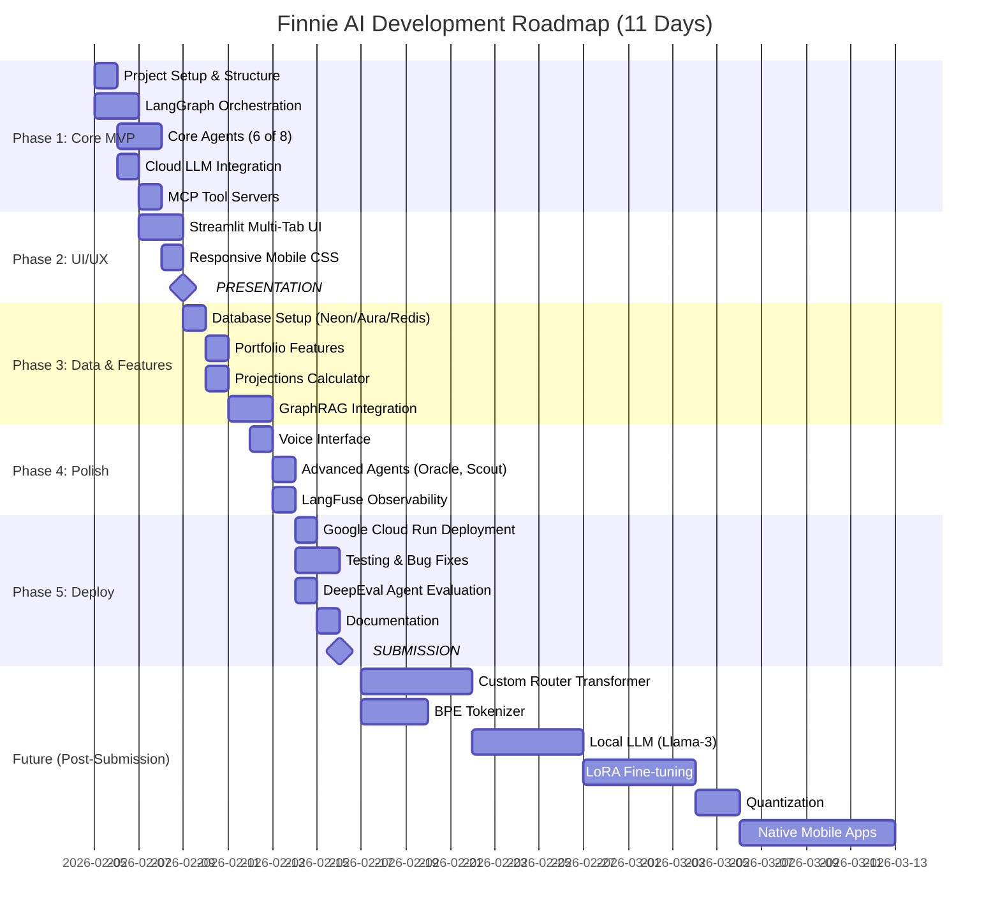
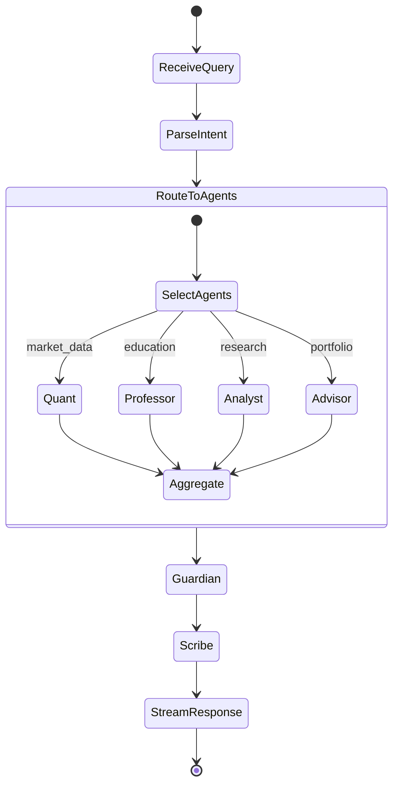
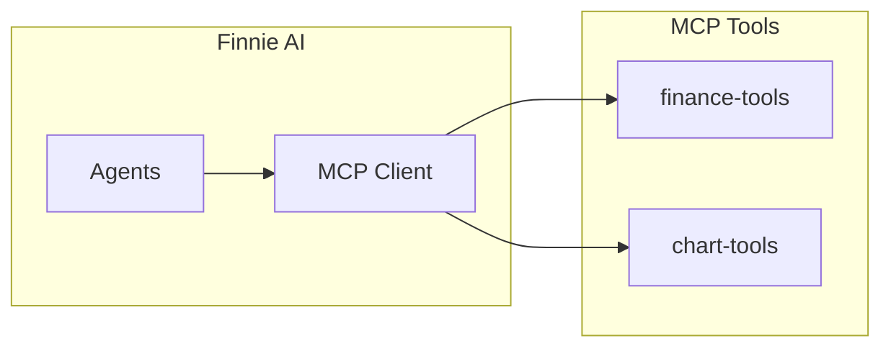
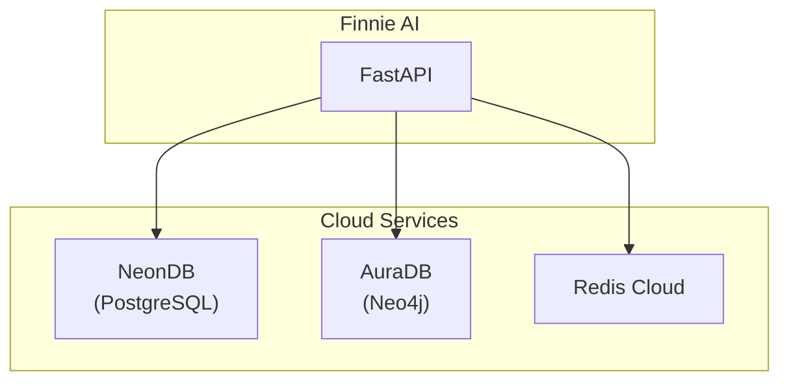
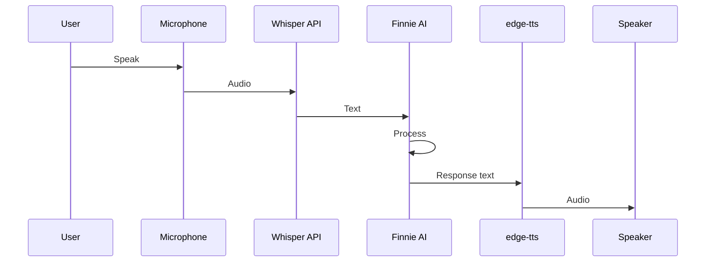

# Finnie AI — Execution Roadmap
## From Architecture to Deployed Application

> **Version:** 2.1.0  
> **Last Updated:** February 8, 2026  
> **Presentation:** February 9, 2026 (1 day)  
> **Submission:** February 16, 2026 (8 days)  
> **Companion Docs:** [SPEC_DEV.md](./SPEC_DEV.md) | [Implementation Q&A](./docs/IMPLEMENTATION_QA.md) | [Code Walkthrough](./docs/CODE_WALKTHROUGH.md)

---

## Executive Timeline



---

## Quick Reference: What's In vs What's Deferred

### ✅ IN SCOPE (Days 1-11)

| Feature | Status | Phase |
|---------|--------|-------|
| LangGraph state machine | ✅ Done | 1 |
| 8 specialized agents | ✅ Done | 1, 4 |
| MCP tool integration (7 tools) | ✅ Done | 1 |
| Multi-provider LLM (OpenAI/Anthropic/Google) | ✅ Done | 1 |
| Streamlit multi-tab UI (5 tabs) | ✅ Done | 2 |
| Responsive mobile design | ✅ Done | 2 |
| yFinance market data | ✅ Done | 1 |
| Portfolio tracking (SQLite) | ✅ Done | 3 |
| Investment projections (Monte Carlo) | ✅ Done | 3 |
| GraphRAG (Neo4j/AuraDB knowledge graph) | ✅ Done | 3 |
| Voice interface (edge-tts + Web Speech API) | ✅ Done | 4 |
| LangFuse observability | ✅ Done | 4 |
| Google Cloud Run deployment | ✅ Done | 5 |
| DeepEval agent evaluation | ✅ Done | 5 |
| FastAPI REST API | ✅ Done | 3 |
| Docker deployment | ✅ Done | 5 |
| Auto API key loading from .env | ✅ Ad-hoc | — |
| Scout agent LLM market analysis | ✅ Ad-hoc | — |
| GraphRAG data/code separation (JSON) | ✅ Ad-hoc | — |

### ⏭️ DEFERRED (Post-Submission)

| Feature | Reason | When |
|---------|--------|------|
| BPE Tokenizer (from scratch) | Learning exercise, not MVP | Week 3 |
| Custom Transformer Router | Complex, cloud LLM works | Week 3 |
| Llama-3 Local LLM | Requires GPU, cloud works | Week 4 |
| LoRA Fine-tuning | Time-intensive | Week 4-5 |
| 4-bit Quantization | Depends on local LLM | Week 5 |
| GPT-4 Distillation | Optimization, not core | Week 5 |
| Native iOS/Android apps | PWA sufficient for now | Week 6+ |
| Bank account integration | Regulatory complexity | Future |

> [!NOTE]
> The system works **end-to-end with cloud LLMs**. Local LLM routing is an optimization we can add via a `USE_LOCAL_LLM=false` config flag.

---

## Phase 1: Core MVP (Days 1-3)
**Goal:** Working chat interface with agents and market data

### 1.1 Project Setup (Day 1 Morning)

```
finnie-ai/
├── src/
│   ├── agents/
│   │   ├── __init__.py
│   │   ├── base_agent.py
│   │   ├── quant_agent.py
│   │   ├── professor_agent.py
│   │   ├── analyst_agent.py
│   │   ├── advisor_agent.py
│   │   ├── guardian_agent.py
│   │   └── scribe_agent.py
│   ├── orchestration/
│   │   ├── __init__.py
│   │   ├── state.py
│   │   ├── graph.py
│   │   └── nodes.py
│   ├── mcp/
│   │   ├── __init__.py
│   │   ├── server.py
│   │   └── tools/
│   │       ├── finance_tools.py
│   │       ├── chart_tools.py
│   │       └── news_tools.py
│   ├── llm/
│   │   ├── __init__.py
│   │   ├── adapter.py
│   │   └── providers/
│   │       ├── openai_provider.py
│   │       ├── anthropic_provider.py
│   │       └── google_provider.py
│   ├── api/
│   │   ├── __init__.py
│   │   ├── main.py
│   │   └── routes/
│   └── ui/
│       ├── app.py
│       ├── pages/
│       └── components/
├── docs/
│   └── IMPLEMENTATION_QA.md
├── tests/
├── docker/
├── SPEC_DEV.md
├── ROADMAP.md
├── requirements.txt
├── pyproject.toml
└── .env.example
```

#### Tasks

- [ ] Initialize Python project with `pyproject.toml`
- [ ] Create directory structure
- [ ] Set up dependencies in `requirements.txt`
- [ ] Create `.env.example` with all required variables
- [ ] Set up basic Docker configuration

#### Pros/Cons: Project Structure

| Approach | Pros | Cons |
|----------|------|------|
| **Monorepo (Chosen)** | ✅ Simple deployment<br/>✅ Shared types<br/>✅ Easy imports | ❌ Can grow large<br/>❌ Must be careful with separation |
| **Microservices** | ✅ Independent scaling<br/>✅ Tech flexibility | ❌ Complex deployment<br/>❌ Network overhead<br/>❌ Overkill for MVP |

---

### 1.2 LangGraph Orchestration (Days 1-2)



#### Tasks

- [ ] Define `FinnieState` TypedDict
- [ ] Create node functions for each agent
- [ ] Build supervisor node with intent parsing
- [ ] Implement parallel agent execution
- [ ] Create state aggregation logic
- [ ] Add streaming response handling
- [ ] Set up conversation memory (in-memory for MVP)

#### Key Code Pattern

```python
# src/orchestration/state.py
from typing import TypedDict, Annotated, List, Optional
from operator import add

class FinnieState(TypedDict):
    # Input
    user_input: str
    session_id: str
    
    # LLM Config (from user settings)
    llm_provider: str
    llm_model: str
    
    # Agent outputs (accumulated via reducer)
    agent_outputs: Annotated[List[dict], add]
    
    # Final output
    final_response: str
    visualizations: List[dict]
    disclaimers: List[str]
```

```python
# src/orchestration/graph.py
from langgraph.graph import StateGraph, END
from .state import FinnieState

def create_graph():
    workflow = StateGraph(FinnieState)
    
    # Add nodes
    workflow.add_node("parse_intent", parse_intent_node)
    workflow.add_node("supervisor", supervisor_node)
    workflow.add_node("quant", quant_node)
    workflow.add_node("professor", professor_node)
    workflow.add_node("analyst", analyst_node)
    workflow.add_node("advisor", advisor_node)
    workflow.add_node("guardian", guardian_node)
    workflow.add_node("scribe", scribe_node)
    
    # Set entry
    workflow.set_entry_point("parse_intent")
    
    # Add edges
    workflow.add_edge("parse_intent", "supervisor")
    workflow.add_conditional_edges(
        "supervisor",
        route_to_agents,
        {
            "quant": "quant",
            "professor": "professor",
            "analyst": "analyst",
            "advisor": "advisor",
            "multi": "parallel_agents"
        }
    )
    
    # All paths lead to guardian → scribe → END
    for agent in ["quant", "professor", "analyst", "advisor"]:
        workflow.add_edge(agent, "guardian")
    workflow.add_edge("guardian", "scribe")
    workflow.add_edge("scribe", END)
    
    return workflow.compile()
```

---

### 1.3 Core Agents (Days 2-3)

#### Implementation Order

1. **The Quant** (first - provides data)
2. **The Professor** (second - most used)
3. **The Guardian** (always runs)
4. **The Scribe** (always runs)
5. **The Analyst** (enhances analysis)
6. **The Advisor** (portfolio features)

#### Agent Template

```python
# src/agents/base_agent.py
from abc import ABC, abstractmethod
from typing import Dict, Any, List
from langchain_core.tools import BaseTool

class BaseFinnieAgent(ABC):
    name: str
    description: str
    system_prompt: str
    tools: List[BaseTool]
    
    @abstractmethod
    async def process(self, state: Dict[str, Any]) -> Dict[str, Any]:
        """Process state and return updates"""
        pass
```

```python
# src/agents/quant_agent.py
from .base_agent import BaseFinnieAgent
from ..mcp.tools import get_stock_price, get_historical_data

class QuantAgent(BaseFinnieAgent):
    name = "The Quant"
    description = "Real-time market data specialist"
    
    system_prompt = """
    You are The Quant, a market data specialist. Your role:
    - Fetch real-time stock prices and data
    - Calculate technical indicators when asked
    - Present data clearly with context
    
    Always include:
    - Current price and daily change
    - Key metrics (P/E, market cap)
    - Data timestamp
    """
    
    tools = [get_stock_price, get_historical_data]
    
    async def process(self, state):
        # Use LLM to decide which tools to call
        # Execute tools via MCP
        # Return formatted data
        pass
```

---

### 1.4 MCP Tool Servers (Day 3)



#### Tasks

- [ ] Create MCP server base
- [ ] Implement finance tools (yFinance wrapper)
- [ ] Implement chart tools (Plotly generation)
- [ ] Add tool discovery endpoint
- [ ] Connect to LangGraph agents

#### Tool Implementations

```python
# src/mcp/tools/finance_tools.py
import yfinance as yf
from typing import Dict, Any

async def get_stock_price(ticker: str) -> Dict[str, Any]:
    """Get current stock price and basic metrics"""
    stock = yf.Ticker(ticker)
    info = stock.info
    
    return {
        "ticker": ticker,
        "price": info.get("currentPrice"),
        "change": info.get("regularMarketChange"),
        "change_percent": info.get("regularMarketChangePercent"),
        "market_cap": info.get("marketCap"),
        "pe_ratio": info.get("forwardPE"),
        "52_week_high": info.get("fiftyTwoWeekHigh"),
        "52_week_low": info.get("fiftyTwoWeekLow"),
        "timestamp": datetime.now().isoformat()
    }

async def get_historical_data(ticker: str, period: str = "1y") -> Dict[str, Any]:
    """Get historical price data for charting"""
    stock = yf.Ticker(ticker)
    history = stock.history(period=period)
    
    return {
        "ticker": ticker,
        "period": period,
        "dates": history.index.strftime("%Y-%m-%d").tolist(),
        "open": history["Open"].tolist(),
        "high": history["High"].tolist(),
        "low": history["Low"].tolist(),
        "close": history["Close"].tolist(),
        "volume": history["Volume"].tolist()
    }
```

---

### 1.5 LLM Provider Integration (Day 2)

#### Multi-Provider Adapter

```python
# src/llm/adapter.py
from typing import List, Dict, Any, AsyncIterator
from abc import ABC, abstractmethod

class LLMAdapter(ABC):
    """Abstract base for LLM providers"""
    
    @abstractmethod
    async def chat(
        self, 
        messages: List[Dict[str, str]], 
        system: str = None,
        **kwargs
    ) -> str:
        pass
    
    @abstractmethod
    async def stream(
        self, 
        messages: List[Dict[str, str]], 
        system: str = None,
        **kwargs
    ) -> AsyncIterator[str]:
        pass

class OpenAIAdapter(LLMAdapter):
    def __init__(self, model: str, api_key: str):
        from openai import AsyncOpenAI
        self.client = AsyncOpenAI(api_key=api_key)
        self.model = model
    
    async def chat(self, messages, system=None, **kwargs):
        msgs = messages.copy()
        if system:
            msgs.insert(0, {"role": "system", "content": system})
        
        response = await self.client.chat.completions.create(
            model=self.model,
            messages=msgs,
            **kwargs
        )
        return response.choices[0].message.content
    
    async def stream(self, messages, system=None, **kwargs):
        msgs = messages.copy()
        if system:
            msgs.insert(0, {"role": "system", "content": system})
        
        stream = await self.client.chat.completions.create(
            model=self.model,
            messages=msgs,
            stream=True,
            **kwargs
        )
        async for chunk in stream:
            if chunk.choices[0].delta.content:
                yield chunk.choices[0].delta.content

class AnthropicAdapter(LLMAdapter):
    def __init__(self, model: str, api_key: str):
        from anthropic import AsyncAnthropic
        self.client = AsyncAnthropic(api_key=api_key)
        self.model = model
    
    async def chat(self, messages, system=None, **kwargs):
        response = await self.client.messages.create(
            model=self.model,
            system=system or "",
            messages=messages,
            max_tokens=4096,
            **kwargs
        )
        return response.content[0].text

class GoogleAdapter(LLMAdapter):
    def __init__(self, model: str, api_key: str):
        import google.generativeai as genai
        genai.configure(api_key=api_key)
        self.model = genai.GenerativeModel(model)
    
    async def chat(self, messages, system=None, **kwargs):
        # Convert messages to Gemini format
        history = []
        for msg in messages[:-1]:
            history.append({
                "role": "user" if msg["role"] == "user" else "model",
                "parts": [msg["content"]]
            })
        
        chat = self.model.start_chat(history=history)
        response = await chat.send_message_async(messages[-1]["content"])
        return response.text

def get_llm_adapter(provider: str, model: str, api_key: str) -> LLMAdapter:
    """Factory function for LLM adapters"""
    adapters = {
        "openai": OpenAIAdapter,
        "anthropic": AnthropicAdapter,
        "google": GoogleAdapter,
    }
    
    if provider not in adapters:
        raise ValueError(f"Unknown provider: {provider}")
    
    return adapters[provider](model, api_key)
```

#### Supported Models Reference

| Provider | Model ID | Display Name |
|----------|----------|--------------|
| `openai` | `gpt-4o` | GPT-4o |
| `openai` | `gpt-4o-mini` | GPT-4o Mini |
| `openai` | `gpt-4-turbo` | GPT-4 Turbo |
| `openai` | `gpt-3.5-turbo` | GPT-3.5 Turbo |
| `anthropic` | `claude-sonnet-4-20250514` | Claude Sonnet 4 |
| `anthropic` | `claude-3-5-sonnet-20241022` | Claude 3.5 Sonnet |
| `anthropic` | `claude-3-haiku-20240307` | Claude 3 Haiku |
| `google` | `gemini-2.0-flash` | Gemini 2.0 Flash |
| `google` | `gemini-1.5-pro` | Gemini 1.5 Pro |
| `google` | `gemini-1.5-flash` | Gemini 1.5 Flash |

---

## Phase 2: UI/UX (Days 3-4)
**Goal:** Multi-tab responsive interface ready for presentation

### 2.1 Streamlit Multi-Tab UI

```python
# src/ui/app.py
import streamlit as st
from pages import chat, portfolio, market, projections, settings

st.set_page_config(
    page_title="Finnie AI",
    page_icon="🦈",
    layout="wide",
    initial_sidebar_state="collapsed"
)

# Load custom CSS for responsive design
with open("static/styles.css") as f:
    st.markdown(f"<style>{f.read()}</style>", unsafe_allow_html=True)

# Header
st.markdown("# 🦈 Finnie AI")

# Tab navigation
tab_chat, tab_portfolio, tab_market, tab_projections, tab_settings = st.tabs([
    "💬 Chat",
    "📊 Portfolio", 
    "📈 Market",
    "🔮 Projections",
    "⚙️ Settings"
])

with tab_chat:
    chat.render()

with tab_portfolio:
    portfolio.render()

with tab_market:
    market.render()

with tab_projections:
    projections.render()

with tab_settings:
    settings.render()
```

### 2.2 Responsive CSS

```css
/* static/styles.css */

/* Mobile-first responsive design */
.stApp {
    max-width: 100%;
}

/* Chat container */
.chat-container {
    width: 100%;
    padding: 1rem;
}

/* Desktop enhancements */
@media (min-width: 768px) {
    .chat-container {
        width: 80%;
        margin: 0 auto;
        padding: 2rem;
    }
}

@media (min-width: 1024px) {
    .chat-container {
        width: 60%;
        max-width: 800px;
    }
}

/* Voice button */
.voice-btn {
    width: 48px;
    height: 48px;
    border-radius: 50%;
    background: linear-gradient(135deg, #667eea 0%, #764ba2 100%);
    border: none;
    cursor: pointer;
    display: flex;
    align-items: center;
    justify-content: center;
}

.voice-btn:hover {
    transform: scale(1.05);
    box-shadow: 0 4px 12px rgba(102, 126, 234, 0.4);
}

/* Message bubbles */
.user-message {
    background: #e3f2fd;
    border-radius: 18px 18px 4px 18px;
    padding: 12px 16px;
    max-width: 80%;
    margin-left: auto;
}

.assistant-message {
    background: #f5f5f5;
    border-radius: 18px 18px 18px 4px;
    padding: 12px 16px;
    max-width: 80%;
}

/* Agent activity indicators */
.agent-activity {
    display: flex;
    align-items: center;
    gap: 8px;
    font-size: 0.875rem;
    color: #666;
}

.agent-activity .spinner {
    width: 16px;
    height: 16px;
    border: 2px solid #e0e0e0;
    border-top-color: #667eea;
    border-radius: 50%;
    animation: spin 1s linear infinite;
}

@keyframes spin {
    to { transform: rotate(360deg); }
}
```

### 2.3 Tasks

- [ ] Create Streamlit app structure
- [ ] Implement Chat tab with streaming
- [ ] Implement Settings tab with LLM provider selection
- [ ] Add responsive CSS
- [ ] Create agent activity indicators
- [ ] Add dark mode toggle

---

## Phase 3: Data & Features (Days 5-7)
**Goal:** Full functionality with databases and advanced features

### 3.1 Database Setup



#### Tasks

- [ ] Create NeonDB project and configure connection
- [ ] Create AuraDB instance and import schema
- [ ] Create Redis Cloud instance
- [ ] Create database client wrappers
- [ ] Implement connection pooling

### 3.2 Portfolio Features

#### Tasks

- [ ] Create holdings management UI
- [ ] Implement portfolio value calculation
- [ ] Add risk metrics (Sharpe, beta, volatility)
- [ ] Create allocation pie chart
- [ ] Add rebalancing suggestions

### 3.3 Projections Calculator

```python
# src/tools/projections.py
import numpy as np
from typing import Dict, List

def project_investment(
    initial_amount: float,
    monthly_contribution: float,
    years: int,
    expected_return: float = 0.08,
    volatility: float = 0.15,
    simulations: int = 1000
) -> Dict[str, List[float]]:
    """
    Monte Carlo simulation for investment projections.
    
    Returns percentile paths: p10 (conservative), p50 (expected), p90 (optimistic)
    """
    months = years * 12
    dt = 1/12  # Monthly steps
    
    # Run simulations
    paths = np.zeros((simulations, months + 1))
    paths[:, 0] = initial_amount
    
    for sim in range(simulations):
        for month in range(1, months + 1):
            # Log-normal return model
            random_return = np.random.normal(
                expected_return * dt,
                volatility * np.sqrt(dt)
            )
            paths[sim, month] = (
                paths[sim, month-1] * (1 + random_return) + 
                monthly_contribution
            )
    
    # Calculate percentiles
    p10 = np.percentile(paths, 10, axis=0)
    p50 = np.percentile(paths, 50, axis=0)
    p90 = np.percentile(paths, 90, axis=0)
    
    # Generate time points
    months_list = list(range(months + 1))
    
    return {
        "months": months_list,
        "conservative": p10.tolist(),
        "expected": p50.tolist(),
        "optimistic": p90.tolist()
    }
```

#### Tasks

- [ ] Implement Monte Carlo simulation
- [ ] Create interactive projection UI
- [ ] Add time horizon slider
- [ ] Add risk level selector
- [ ] Generate animated projection chart

### 3.4 GraphRAG Integration

#### Tasks

- [ ] Ingest 100+ financial articles
- [ ] Create Neo4j entity relationships
- [ ] Implement Redis vector embeddings
- [ ] Build hybrid retrieval function
- [ ] Connect to Professor agent

---

## Phase 4: Polish (Days 8-9)
**Goal:** Voice, advanced agents, observability

### 4.1 Voice Interface



#### Tasks

- [ ] Integrate OpenAI Whisper API
- [ ] Add edge-tts for voice output
- [ ] Create voice mode toggle
- [ ] Add audio waveform visualization
- [ ] Implement auto-listen after response

### 4.2 Advanced Agents

#### The Oracle (Projections)

```python
class OracleAgent(BaseFinnieAgent):
    name = "The Oracle"
    description = "Investment projection and scenario analyst"
    
    system_prompt = """
    You are The Oracle, a projection specialist. Your role:
    - Create investment growth projections
    - Model different scenarios (conservative/moderate/aggressive)
    - Explain probability ranges and assumptions
    
    Always:
    - State assumptions clearly
    - Show range of outcomes
    - Warn about uncertainty
    """
    
    tools = [project_investment, compare_scenarios]
```

#### The Scout (Trends)

```python
class ScoutAgent(BaseFinnieAgent):
    name = "The Scout"
    description = "Trend and opportunity discoverer"
    
    system_prompt = """
    You are The Scout, a trend analyst. Your role:
    - Identify emerging sectors and themes
    - Spot momentum shifts
    - Explain the "why" behind trends
    
    Focus on:
    - Sector rotation patterns
    - Emerging technology themes
    - Macroeconomic drivers
    """
    
    tools = [scan_sectors, analyze_momentum]
```

### 4.3 LangFuse Observability

```python
# src/observability/langfuse.py
from langfuse import Langfuse
from langfuse.callback import CallbackHandler

langfuse = Langfuse(
    public_key=os.getenv("LANGFUSE_PUBLIC_KEY"),
    secret_key=os.getenv("LANGFUSE_SECRET_KEY")
)

def get_trace_handler(session_id: str, user_id: str = None):
    """Get LangFuse callback handler for tracing"""
    return CallbackHandler(
        session_id=session_id,
        user_id=user_id
    )
```

#### Tasks

- [ ] Create LangFuse account (free tier)
- [ ] Integrate with LangGraph
- [ ] Add trace IDs to all requests
- [ ] Set up alerting for errors
- [ ] Create cost tracking dashboard

---

## Phase 5: Deploy (Days 10-11)
**Goal:** Live on Google Cloud Run

### 5.1 Deployment Configuration

```dockerfile
# docker/Dockerfile
FROM python:3.11-slim

WORKDIR /app

# Install dependencies
COPY requirements.txt .
RUN pip install --no-cache-dir -r requirements.txt

# Copy source
COPY src/ ./src/
COPY static/ ./static/

# Expose port
EXPOSE 8080

# Run
CMD ["streamlit", "run", "src/ui/app.py", "--server.port=8080", "--server.address=0.0.0.0"]
```

```yaml
# cloudbuild.yaml
steps:
  - name: 'gcr.io/cloud-builders/docker'
    args: ['build', '-t', 'gcr.io/$PROJECT_ID/finnie-ai', '-f', 'docker/Dockerfile', '.']
  
  - name: 'gcr.io/cloud-builders/docker'
    args: ['push', 'gcr.io/$PROJECT_ID/finnie-ai']
  
  - name: 'gcr.io/cloud-builders/gcloud'
    args:
      - 'run'
      - 'deploy'
      - 'finnie-ai'
      - '--image=gcr.io/$PROJECT_ID/finnie-ai'
      - '--platform=managed'
      - '--region=us-central1'
      - '--allow-unauthenticated'
      - '--memory=2Gi'
      - '--cpu=2'

images:
  - 'gcr.io/$PROJECT_ID/finnie-ai'
```

### 5.2 Tasks

- [ ] Create GCP project
- [ ] Configure Secret Manager for API keys
- [ ] Build and push Docker image
- [ ] Deploy to Cloud Run
- [ ] Configure custom domain (optional)
- [ ] Test deployed application
- [ ] Create deployment documentation

---

## Future Enhancements (Post-Submission)

### Custom Intelligence Layer

| Feature | Purpose | Timeline |
|---------|---------|----------|
| BPE Tokenizer | Demonstrate tokenization understanding | Week 3 |
| Custom Transformer Router | Query complexity classification | Week 3-4 |
| Llama-3 Local LLM | Cost reduction, privacy | Week 4 |
| LoRA Fine-tuning | Financial domain specialization | Week 4-5 |
| Quantization | Efficient inference | Week 5 |
| Distillation | Transfer GPT-4 knowledge | Week 5 |

### Platform Extensions

| Feature | Approach | Timeline |
|---------|----------|----------|
| PWA | Add service worker + manifest | Week 3 |
| iOS App | Capacitor wrapper | Week 6 |
| Android App | Capacitor wrapper | Week 6 |
| Desktop | Electron wrapper | Week 7+ |

### Advanced Integrations

| Feature | Complexity | Timeline |
|---------|------------|----------|
| Bank Account Linking | High (Plaid API) | Future |
| Real-time Trading Alerts | Medium | Future |
| Social Features | Medium | Future |

---

## Risk Mitigation

| Risk | Probability | Impact | Mitigation |
|------|-------------|--------|------------|
| LLM API rate limits | Medium | High | Use multiple providers, cache responses |
| Database connection issues | Low | High | Connection pooling, retry logic |
| Presentation not ready | Low | Critical | Focus on demo-able features first |
| Cloud deployment fails | Low | High | Test locally with Docker first |
| Voice latency | Medium | Medium | Make voice optional, async processing |

---

## Daily Checklist

### Day 1 (Feb 5) ✅
- [x] Project structure
- [x] LangGraph basic setup
- [x] LLM adapter framework

### Day 2 (Feb 6) ✅
- [x] Complete LangGraph orchestration
- [x] Implement 4 core agents
- [x] MCP finance tools

### Day 3 (Feb 7) ✅
- [x] Remaining agents (Guardian, Scribe)
- [x] Streamlit multi-tab UI
- [x] Chat functionality

### Day 4 (Feb 8) ✅
- [x] Responsive CSS
- [x] Settings page with LLM selection
- [x] Voice interface (edge-tts TTS + Web Speech API STT)
- [x] GraphRAG knowledge graph (Neo4j client, ingestion, retrieval)
- [x] GraphRAG data/code separation (JSON data files)
- [x] Scout agent LLM-powered market analysis
- [x] Auto API key loading from .env
- [x] DeepEval agent evaluation tests
- [x] Code walkthrough documentation
- [x] Demo preparation

### Day 5 (Feb 9) — PRESENTATION
- [ ] Present architecture & working demo
- [ ] Show all agent capabilities
- [ ] Demonstrate voice, GraphRAG, market data

### Days 6-7 (Feb 10-11)
- [x] Database connections (SQLite for MVP)
- [x] Portfolio features
- [x] Projections calculator (Monte Carlo)
- [x] FastAPI REST API

### Days 8-9 (Feb 12-13)
- [x] Advanced agents (Oracle, Scout)
- [x] LangFuse observability
- [ ] Additional GraphRAG data enrichment
- [ ] Edge case testing

### Days 10-11 (Feb 14-15)
- [x] Google Cloud Run deployment
- [x] Docker configuration
- [ ] Final testing and bug fixes
- [ ] Documentation polish

### Day 12 (Feb 16) — SUBMISSION
- [ ] Final testing
- [ ] Submit deployed URL
- [ ] Submit codebase

---

*Roadmap prepared for Interview Kickstart Capstone Project*  
*Finnie AI v2.1.0 — "Hedge Fund in a Box"*  
*Last Updated: February 8, 2026*
