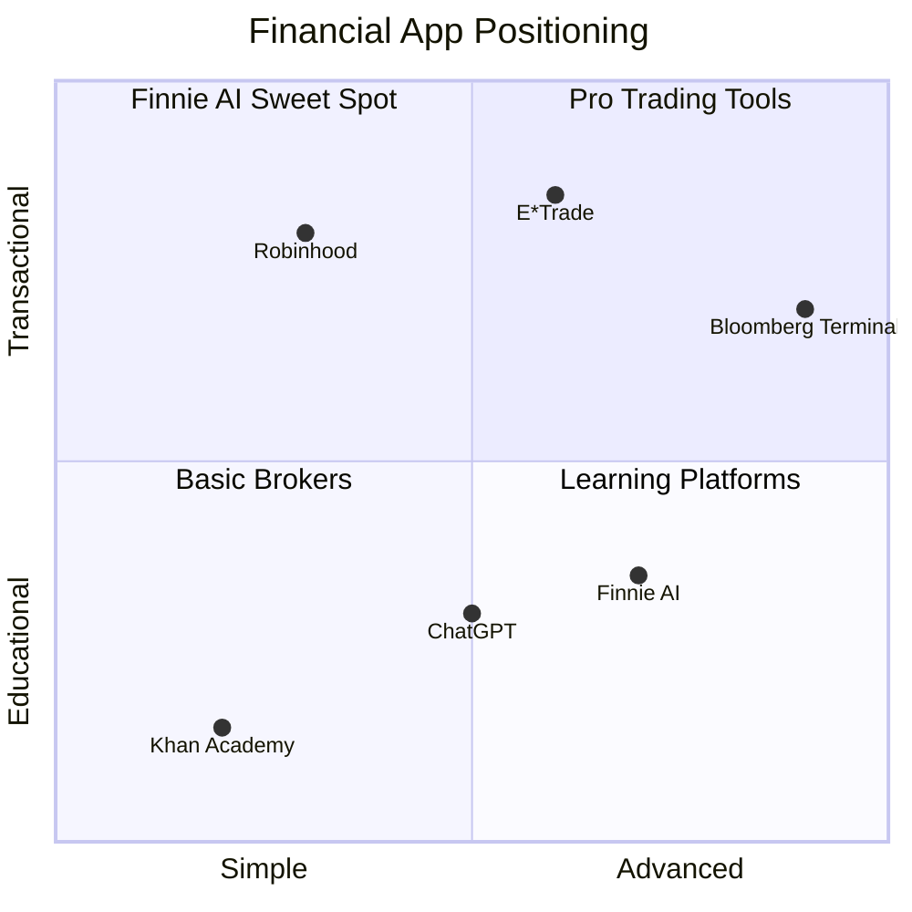
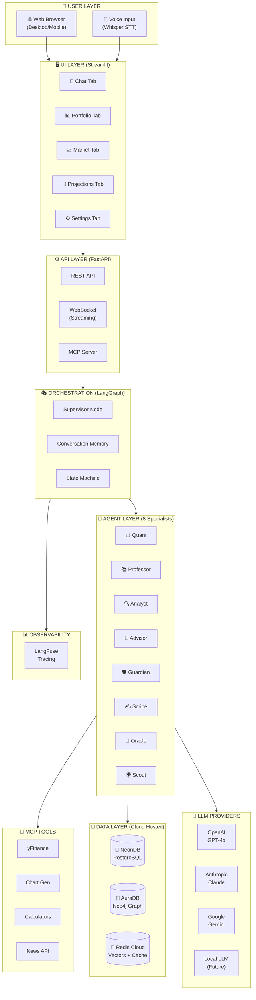
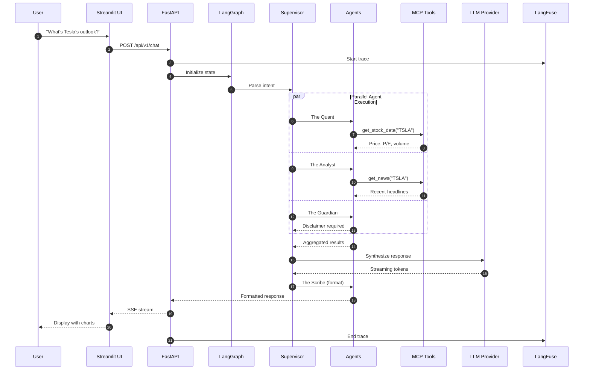
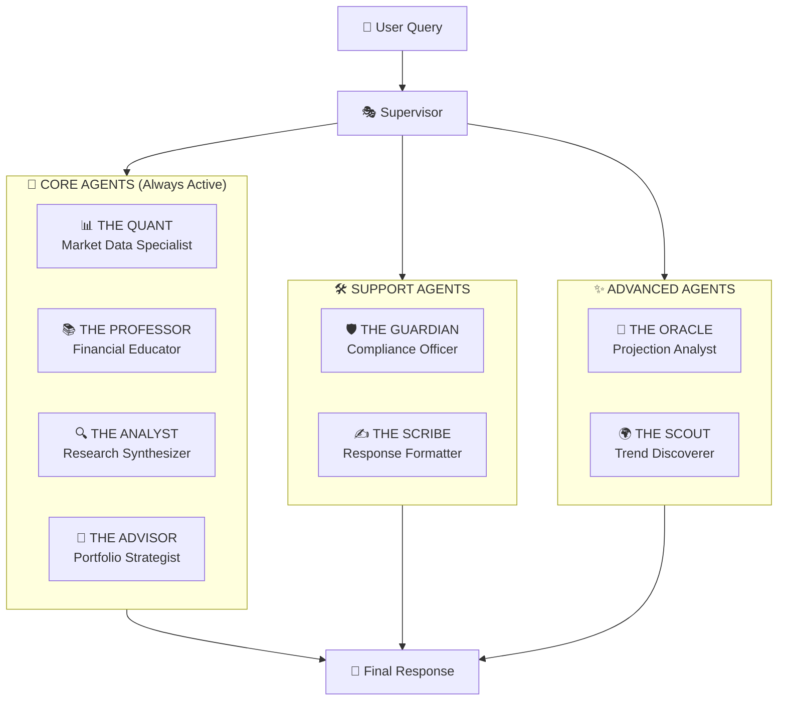
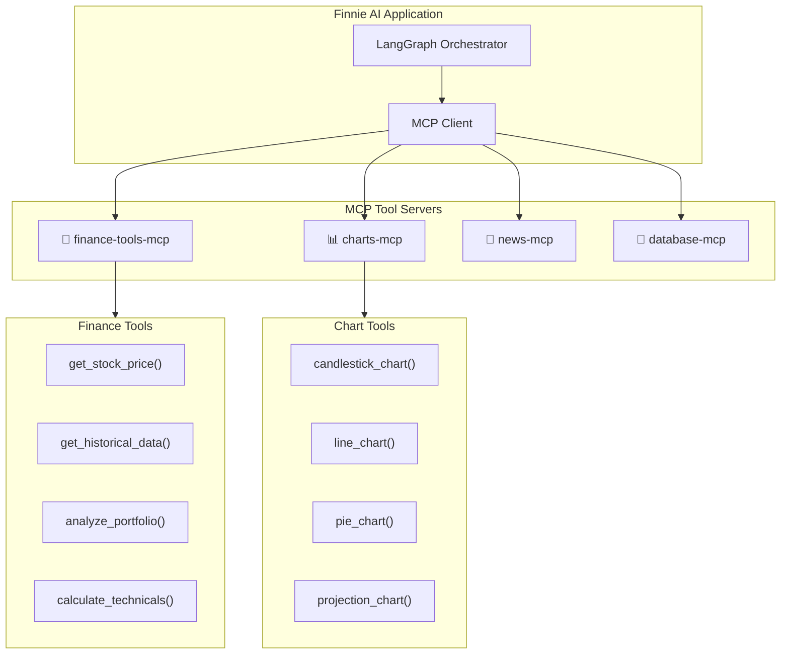
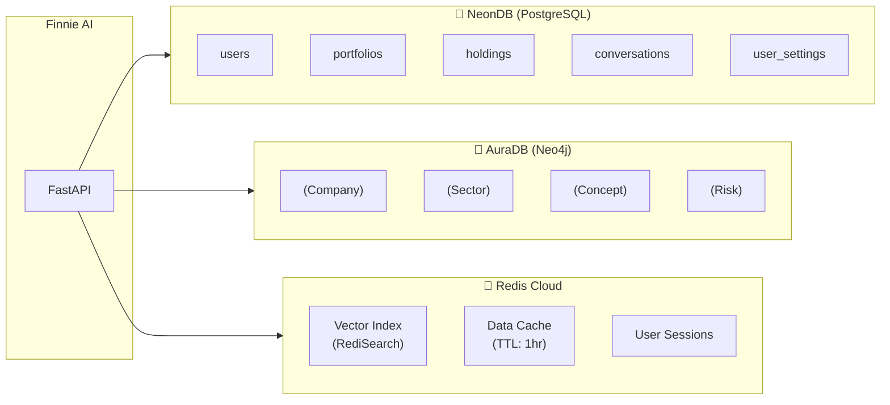
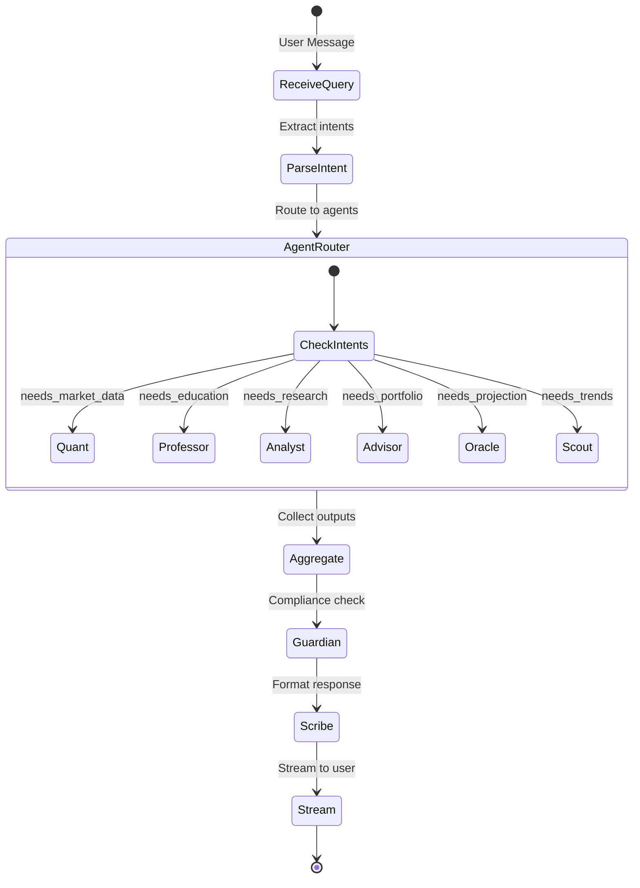
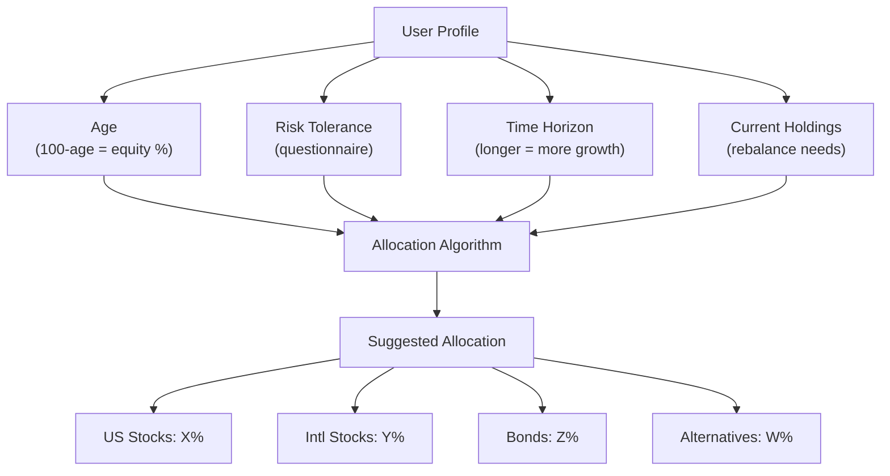
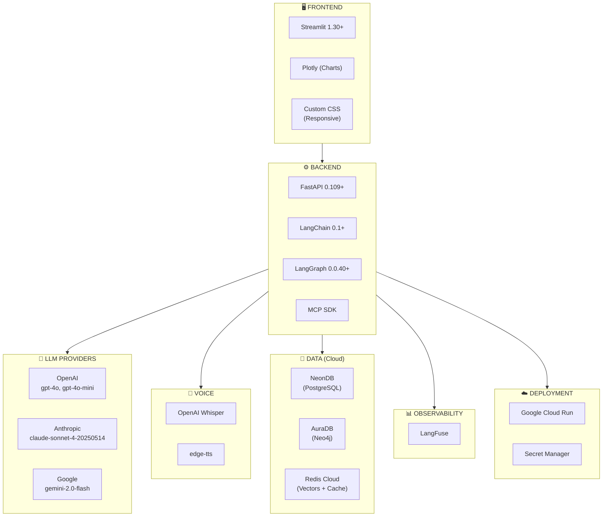
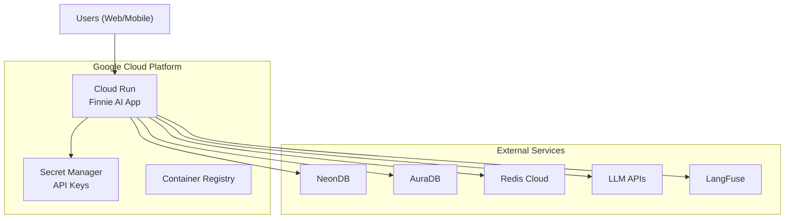

# Finnie AI — Technical Specification Document
## Autonomous Financial Intelligence System

> **Codename:** "Hedge Fund in a Box"  
> **Version:** 2.1.0  
> **Last Updated:** February 8, 2026  
> **Author:** Principal AI Architect  
> **Companion Docs:** [ROADMAP.md](./ROADMAP.md) | [Implementation Q&A](./docs/IMPLEMENTATION_QA.md) | [Code Walkthrough](./docs/CODE_WALKTHROUGH.md)

---

## Table of Contents

1. [Executive Summary](#1-executive-summary)
2. [System Architecture](#2-system-architecture)
3. [Agent Roster — The Eight Specialists](#3-agent-roster--the-eight-specialists)
4. [MCP & A2A Integration](#4-mcp--a2a-integration)
5. [Data Layer Architecture](#5-data-layer-architecture)
6. [LangGraph Orchestration](#6-langgraph-orchestration)
7. [Feature Specifications](#7-feature-specifications)
8. [UI/UX Design](#8-uiux-design)
9. [Technology Stack](#9-technology-stack)
10. [LLM Provider Configuration](#10-llm-provider-configuration)
11. [Observability & Monitoring](#11-observability--monitoring)
12. [Deployment Architecture](#12-deployment-architecture)
13. [Security & Compliance](#13-security--compliance)
14. [Scoring Matrix Alignment](#14-scoring-matrix-alignment)

---

## 1. Executive Summary

### 1.1 Vision

**Finnie AI** is an **Autonomous Financial Intelligence System** — a multi-agent conversational assistant that democratizes financial literacy through specialized AI agents, real-time market data, and personalized portfolio guidance.

### 1.2 What Finnie AI Does

| Capability | Description | Comparison |
|------------|-------------|------------|
| **💬 Financial Education** | Explains concepts at user's level | Like Khan Academy, AI-powered |
| **📊 Market Analysis** | Real-time data, charts, technicals | Like Bloomberg Terminal, simplified |
| **📈 Portfolio Tracking** | Holdings, allocation, risk metrics | Like Personal Capital |
| **🔮 Investment Projections** | Monte Carlo simulations, scenarios | Like Vanguard calculator, enhanced |
| **🎤 Voice Interface** | Natural conversation, hands-free | Like ChatGPT voice mode |
| **🌍 Trend Discovery** | Emerging sectors, startup analysis | Unique to Finnie |

### 1.3 What Finnie AI Does NOT Do

> [!IMPORTANT]
> Finnie AI is an **educational and analytical tool**, NOT a trading platform.

- ❌ **No Trade Execution** — Cannot buy/sell securities
- ❌ **No Financial Advice** — Provides information, not recommendations
- ❌ **No Account Management** — Doesn't connect to brokerage accounts (MVP)

### 1.4 Competitive Positioning



### 1.5 Milestone Timeline

| Milestone | Date | Deliverables |
|-----------|------|--------------|
| 🎯 **Presentation** | Feb 9, 2026 | Architecture, UI mocks, demo flows |
| 🚀 **Submission** | Feb 16, 2026 | Working app, deployed to Cloud, docs |
| 🔧 **Enhancement** | Post-submission | Local LLM, custom router, native apps |

---

## 2. System Architecture

### 2.1 High-Level Architecture (MVP)



### 2.2 Request Flow Sequence



---

## 3. Agent Roster — The Eight Specialists

### 3.1 Agent Overview



### 3.2 Detailed Agent Specifications

#### 📊 The Quant — Market Data Specialist

| Attribute | Value |
|-----------|-------|
| **Primary Function** | Real-time market data retrieval and technical analysis |
| **MCP Tools** | `get_stock_price`, `get_historical_data`, `calculate_technicals` |
| **Triggers** | Stock tickers, price queries, chart requests |
| **Output** | Market data, technical indicators, chart specifications |

**Example Interaction:**
> **User:** "What's AAPL trading at?"  
> **Quant:** 📊 AAPL is at $189.45 (+1.2%). Today's range: $187.50-$190.20. Volume is 15% above average. RSI: 58 (neutral).

---

#### 📚 The Professor — Financial Educator

| Attribute | Value |
|-----------|-------|
| **Primary Function** | Explain financial concepts adapted to user's level |
| **MCP Tools** | `search_knowledge_base`, `create_analogy`, `generate_quiz` |
| **Triggers** | "What is...", "Explain...", "How does..." |
| **Output** | Educational content, analogies, examples |

**Example Interaction:**
> **User:** "What's a P/E ratio?"  
> **Professor:** 📚 The P/E (Price-to-Earnings) ratio is like asking "How many years of profits would equal the stock price?" If a company earns $5/share and trades at $100, the P/E is 20 — meaning you're paying 20 years of current earnings. Lower P/E = potentially undervalued, higher P/E = growth expectations.

---

#### 🔍 The Analyst — Research Synthesizer

| Attribute | Value |
|-----------|-------|
| **Primary Function** | News analysis, sentiment, and sector correlations |
| **MCP Tools** | `get_news`, `analyze_sentiment`, `find_correlations` |
| **Triggers** | "News about...", "What's happening with...", analysis questions |
| **Output** | News summaries, sentiment scores, trend analysis |

---

#### 💼 The Advisor — Portfolio Strategist

| Attribute | Value |
|-----------|-------|
| **Primary Function** | Portfolio construction, risk assessment, rebalancing |
| **MCP Tools** | `analyze_portfolio`, `calculate_risk_metrics`, `suggest_allocation` |
| **Triggers** | Portfolio questions, allocation advice, risk queries |
| **Output** | Portfolio metrics, allocation suggestions, risk analysis |

---

#### 🛡️ The Guardian — Compliance Officer

| Attribute | Value |
|-----------|-------|
| **Primary Function** | Add disclaimers, flag risks, ensure compliance |
| **MCP Tools** | `classify_risk_level`, `generate_disclaimer` |
| **Triggers** | All responses (automatic) |
| **Output** | Risk level, appropriate disclaimers |

**Disclaimer Levels:**

| Level | Trigger | Disclaimer |
|-------|---------|------------|
| 🟢 LOW | Education, definitions | "This is for educational purposes only." |
| 🟡 MEDIUM | Stock analysis, portfolio review | "This is not financial advice. Consult a licensed advisor." |
| 🔴 HIGH | Buy/sell signals, leverage, crypto | "⚠️ HIGH RISK content. Past performance ≠ future results." |

---

#### ✍️ The Scribe — Response Formatter

| Attribute | Value |
|-----------|-------|
| **Primary Function** | Synthesize multi-agent outputs into cohesive response |
| **MCP Tools** | `generate_chart`, `format_response`, `create_summary` |
| **Triggers** | All responses (final stage) |
| **Output** | Formatted text, charts, tables |

---

#### 🔮 The Oracle — Projection Analyst (NEW)

| Attribute | Value |
|-----------|-------|
| **Primary Function** | Investment projections and scenario modeling |
| **MCP Tools** | `monte_carlo_simulation`, `project_growth`, `compare_scenarios` |
| **Triggers** | "If I invest...", "Project...", time-based questions |
| **Output** | Growth projections, scenario comparisons, probability ranges |

**Example Interaction:**
> **User:** "If I invest $10,000 in an index fund, what will I have in 10 years?"  
> **Oracle:** 🔮 Based on historical S&P 500 returns (10.5% avg):
> - **Conservative (10th percentile):** $19,200
> - **Expected (median):** $27,100  
> - **Optimistic (90th percentile):** $38,400
> 
> *[Interactive projection chart displayed]*

---

#### 🌍 The Scout — Trend Discoverer (NEW)

| Attribute | Value |
|-----------|-------|
| **Primary Function** | Identify emerging trends, sectors, and opportunities |
| **MCP Tools** | `scan_sectors`, `identify_trends`, `analyze_momentum` |
| **Triggers** | "What's trending...", "Emerging...", sector questions |
| **Output** | Trend analysis, sector momentum, emerging themes |

**Example Interaction:**
> **User:** "What sectors are hot right now?"  
> **Scout:** 🌍 Current sector momentum (30-day):
> 1. **Nuclear Energy** (+18%) — AI data center power demand
> 2. **Semiconductors** (+12%) — AI chip demand continues
> 3. **Defense** (+9%) — Geopolitical tensions
> 
> *Cooling: Commercial Real Estate (-8%), Regional Banks (-5%)*

---

## 4. MCP & A2A Integration

### 4.1 MCP (Model Context Protocol) Architecture

> [!IMPORTANT]
> MCP is **critical** for the rubric. It standardizes how agents interact with external tools.



### 4.2 MCP Tool Definitions

```json
{
  "tools": [
    {
      "name": "get_stock_price",
      "description": "Get current stock price and basic metrics",
      "inputSchema": {
        "type": "object",
        "properties": {
          "ticker": {"type": "string", "description": "Stock ticker symbol"}
        },
        "required": ["ticker"]
      }
    },
    {
      "name": "get_historical_data",
      "description": "Get historical price data for charting",
      "inputSchema": {
        "type": "object",
        "properties": {
          "ticker": {"type": "string"},
          "period": {"type": "string", "enum": ["1d", "5d", "1mo", "3mo", "6mo", "1y", "5y", "10y"]}
        },
        "required": ["ticker", "period"]
      }
    },
    {
      "name": "project_investment",
      "description": "Project investment growth using Monte Carlo simulation",
      "inputSchema": {
        "type": "object",
        "properties": {
          "initial_amount": {"type": "number"},
          "monthly_contribution": {"type": "number"},
          "years": {"type": "integer"},
          "risk_level": {"type": "string", "enum": ["conservative", "moderate", "aggressive"]}
        },
        "required": ["initial_amount", "years"]
      }
    }
  ]
}
```

### 4.3 A2A (Agent-to-Agent) Protocol

**Implementation Phase:** Post-MVP (after core submission)

**Purpose:** Allow Finnie AI to be discovered and used by other AI systems.

```python
# A2A Agent Card
FINNIE_AGENT_CARD = {
    "name": "Finnie AI",
    "description": "Financial education and analysis multi-agent assistant",
    "version": "1.0.0",
    "capabilities": [
        "market_data",
        "portfolio_analysis", 
        "financial_education",
        "investment_projections"
    ],
    "endpoint": "https://finnie-ai.run.app/a2a",
    "authentication": {
        "type": "bearer",
        "required": True
    },
    "supported_content_types": ["application/json"],
    "rate_limit": "100/hour"
}
```

---

## 5. Data Layer Architecture

### 5.1 Database Selection (All Cloud-Hosted)

| Database | Service | Purpose | Free Tier |
|----------|---------|---------|-----------|
| **PostgreSQL** | NeonDB | Users, portfolios, settings | 512 MB |
| **Neo4j** | AuraDB | Knowledge graph | 200K nodes |
| **Redis** | Redis Cloud | Vectors, cache, sessions | 30 MB |

### 5.2 Architecture Diagram



### 5.3 PostgreSQL Schema (NeonDB)

```sql
-- Users
CREATE TABLE users (
    id UUID PRIMARY KEY DEFAULT gen_random_uuid(),
    email VARCHAR(255) UNIQUE NOT NULL,
    created_at TIMESTAMP DEFAULT NOW(),
    knowledge_level VARCHAR(20) DEFAULT 'beginner'
);

-- User Settings (LLM Provider Config)
CREATE TABLE user_settings (
    id UUID PRIMARY KEY DEFAULT gen_random_uuid(),
    user_id UUID REFERENCES users(id),
    llm_provider VARCHAR(50) DEFAULT 'openai',
    llm_model VARCHAR(100) DEFAULT 'gpt-4o',
    api_key_encrypted TEXT,
    temperature DECIMAL(2,1) DEFAULT 0.7,
    voice_enabled BOOLEAN DEFAULT true
);

-- Portfolios
CREATE TABLE portfolios (
    id UUID PRIMARY KEY DEFAULT gen_random_uuid(),
    user_id UUID REFERENCES users(id),
    name VARCHAR(100) NOT NULL,
    is_primary BOOLEAN DEFAULT false,
    created_at TIMESTAMP DEFAULT NOW()
);

-- Holdings
CREATE TABLE holdings (
    id UUID PRIMARY KEY DEFAULT gen_random_uuid(),
    portfolio_id UUID REFERENCES portfolios(id),
    ticker VARCHAR(10) NOT NULL,
    shares DECIMAL(15, 4) NOT NULL,
    avg_cost_basis DECIMAL(15, 4),
    UNIQUE(portfolio_id, ticker)
);

-- Conversations
CREATE TABLE conversations (
    id UUID PRIMARY KEY DEFAULT gen_random_uuid(),
    user_id UUID REFERENCES users(id),
    started_at TIMESTAMP DEFAULT NOW(),
    ended_at TIMESTAMP
);

-- Messages
CREATE TABLE messages (
    id UUID PRIMARY KEY DEFAULT gen_random_uuid(),
    conversation_id UUID REFERENCES conversations(id),
    role VARCHAR(20) NOT NULL,
    content TEXT NOT NULL,
    agent_used VARCHAR(50),
    created_at TIMESTAMP DEFAULT NOW()
);
```

### 5.4 Redis Vector Schema

```python
# Redis Vector Index for Knowledge Base
from redis.commands.search.field import VectorField, TextField, TagField

VECTOR_SCHEMA = [
    TextField("content"),
    TagField("category"),
    TagField("difficulty"),
    VectorField(
        "embedding",
        "HNSW",
        {
            "TYPE": "FLOAT32",
            "DIM": 1536,  # OpenAI embedding dim
            "DISTANCE_METRIC": "COSINE"
        }
    )
]
```

### 5.5 Neo4j Graph Schema

```cypher
// Nodes
(:Company {id, name, ticker, sector_id, market_cap, pe_ratio})
(:Sector {id, name, parent_sector})
(:Concept {id, name, category, difficulty, definition})
(:Risk {id, name, type, severity})

// Relationships
(c:Company)-[:BELONGS_TO]->(s:Sector)
(c1:Company)-[:COMPETES_WITH]->(c2:Company)
(s:Sector)-[:HAS_RISK]->(r:Risk)
(c1:Concept)-[:RELATES_TO]->(c2:Concept)
```

---

## 6. LangGraph Orchestration

### 6.1 State Definition

```python
from typing import TypedDict, Annotated, List, Optional
from operator import add

class FinnieState(TypedDict):
    # Input
    user_input: str
    session_id: str
    user_id: Optional[str]
    
    # LLM Config
    llm_provider: str  # 'openai', 'anthropic', 'google'
    llm_model: str     # 'gpt-4o', 'claude-sonnet-4-20250514', etc.
    
    # Agent Outputs (accumulated)
    agent_outputs: Annotated[List[dict], add]
    
    # Data
    market_data: Optional[dict]
    knowledge_context: Optional[List[str]]
    portfolio_data: Optional[dict]
    projections: Optional[dict]
    
    # Compliance
    risk_level: str
    disclaimers: List[str]
    
    # Output
    final_response: str
    visualizations: List[dict]
    
    # Observability
    trace_id: str
    latency_ms: int
```

### 6.2 Graph Structure



---

## 7. Feature Specifications

### 7.1 Core Features (MVP — Days 1-7)

| Feature | Description | Priority |
|---------|-------------|----------|
| **Conversational Chat** | Natural language Q&A with memory | P0 |
| **Real-Time Stock Data** | Live prices via yFinance | P0 |
| **Financial Education** | Concept explanations | P0 |
| **Multi-Tab UI** | Chat, Portfolio, Market tabs | P0 |
| **LLM Provider Settings** | User selects provider/model | P0 |
| **Streaming Responses** | Token-by-token display | P0 |

### 7.2 Enhanced Features (Days 4-10)

| Feature | Description | Priority |
|---------|-------------|----------|
| **Investment Projections** | Monte Carlo scenarios | ✅ Done |
| **Portfolio Analysis** | Holdings, risk metrics | ✅ Done |
| **Voice Interface** | edge-tts TTS + Web Speech API STT | ✅ Done |
| **GraphRAG Retrieval** | Neo4j knowledge graph + retrieval | ✅ Done |
| **Trend Discovery** | Scout agent LLM-powered sector analysis | ✅ Done |
| **MCP Tools** | 7 standardized tools registered | ✅ Done |
| **DeepEval Evaluation** | Answer relevancy, hallucination, faithfulness, bias | ✅ Done |
| **LangFuse Observability** | Tracing, latency, token usage metrics | ✅ Done |
| **Docker Deployment** | Dockerfile + Cloud Run config | ✅ Done |
| **FastAPI REST API** | /chat, /tools endpoints | ✅ Done |

### 7.3 Investment Projection Feature

**Projection Variables:**

| Variable | Range | Default |
|----------|-------|---------|
| Initial Investment | $100 - $10M | $10,000 |
| Monthly Contribution | $0 - $50K | $500 |
| Time Horizon | 3mo - 30yr | 5 years |
| Risk Level | Conservative/Moderate/Aggressive | Moderate |
| Expected Return | 4% - 15% | Based on risk level |

**Return Assumptions by Risk Level:**

| Risk Level | Expected Return | Volatility | Asset Mix |
|------------|-----------------|------------|-----------|
| Conservative | 6% | 8% | 30% stocks, 60% bonds, 10% cash |
| Moderate | 8% | 12% | 60% stocks, 30% bonds, 10% alt |
| Aggressive | 10% | 18% | 80% stocks, 10% bonds, 10% alt |

### 7.4 Portfolio Balancing Suggestions

**Factors Considered:**



---

## 8. UI/UX Design

### 8.1 Design Principles

1. **Mobile-First Responsive** — Works on all screen sizes
2. **Progressive Loading** — Never show blank screens
3. **Real-Time Feedback** — Show agent activity during processing
4. **Accessibility** — Voice support, keyboard navigation, ARIA labels

### 8.2 Main Layout Mock

```
┌──────────────────────────────────────────────────────────────────────────┐
│  🦈 Finnie AI                                   [🌙 Dark Mode] [⚙️]     │
├──────────────────────────────────────────────────────────────────────────┤
│  [💬 Chat] [📊 Portfolio] [📈 Market] [🔮 Projections] [📚 Learn]       │
├──────────────────────────────────────────────────────────────────────────┤
│                                                                          │
│  ┌────────────────────────────────────────────────────────────────────┐  │
│  │                                                                    │  │
│  │   👤 What's Tesla's P/E ratio and how does it compare to Ford?    │  │
│  │                                                                    │  │
│  │   🦈 Let me analyze that for you...                               │  │
│  │                                                                    │  │
│  │   ├─ 📊 Fetching TSLA data...        ✅                           │  │
│  │   ├─ 📊 Fetching F data...           ✅                           │  │
│  │   └─ 🔍 Analyzing comparison...      ⏳                           │  │
│  │                                                                    │  │
│  │   ───────────────────────────────────────                         │  │
│  │                                                                    │  │
│  │   🦈 Here's the comparison:                                       │  │
│  │                                                                    │  │
│  │   | Metric      | Tesla (TSLA) | Ford (F) |                       │  │
│  │   |-------------|--------------|----------|                       │  │
│  │   | P/E Ratio   | 68.5         | 12.3     |                       │  │
│  │   | Market Cap  | $780B        | $48B     |                       │  │
│  │   | Revenue     | $96B         | $176B    |                       │  │
│  │                                                                    │  │
│  │   Tesla trades at 5.5x Ford's P/E, reflecting growth              │  │
│  │   expectations in the EV market...                                │  │
│  │                                                                    │  │
│  │   📊 [View Chart]                                                 │  │
│  │                                                                    │  │
│  │   ⚠️ This is for educational purposes only.                      │  │
│  │                                                                    │  │
│  └────────────────────────────────────────────────────────────────────┘  │
│                                                                          │
│  ┌────────────────────────────────────────────────────────────────────┐  │
│  │  [🎤]  Type a message or ask anything...            [Send ➤]      │  │
│  └────────────────────────────────────────────────────────────────────┘  │
│                                                                          │
└──────────────────────────────────────────────────────────────────────────┘
```

### 8.3 Portfolio Tab Mock

```
┌──────────────────────────────────────────────────────────────────────────┐
│  🦈 Finnie AI                                   [🌙 Dark Mode] [⚙️]     │
├──────────────────────────────────────────────────────────────────────────┤
│  [💬 Chat] [📊 Portfolio] [📈 Market] [🔮 Projections] [📚 Learn]       │
├──────────────────────────────────────────────────────────────────────────┤
│                                                                          │
│  📊 MY PORTFOLIO                           Total Value: $125,430.00     │
│  ──────────────────────────────────────────────────────────────────────  │
│                                                                          │
│  ┌─────────────────────────────────┐  ┌──────────────────────────────┐  │
│  │      ALLOCATION                 │  │     PERFORMANCE (YTD)        │  │
│  │         ┌──────┐                │  │                              │  │
│  │       ╱╱│ AAPL │╲╲              │  │   Portfolio: +12.4%          │  │
│  │      ╱  │ 35%  │  ╲             │  │   S&P 500:   +8.2%           │  │
│  │     ╱ ┌─┴──────┴─┐ ╲            │  │   ────────────────           │  │
│  │    │  │   MSFT   │  │           │  │   Alpha: +4.2% 📈            │  │
│  │    │  │   25%    │  │           │  │                              │  │
│  │     ╲ └─┬──────┬─┘ ╱            │  │                              │  │
│  │      ╲  │ VTI  │  ╱             │  │                              │  │
│  │       ╲╲│ 40%  │╱╱              │  │                              │  │
│  │         └──────┘                │  │                              │  │
│  └─────────────────────────────────┘  └──────────────────────────────┘  │
│                                                                          │
│  HOLDINGS                                                                │
│  ──────────────────────────────────────────────────────────────────────  │
│  | Symbol | Shares | Price    | Value      | Gain/Loss | %       |     │
│  |--------|--------|----------|------------|-----------|---------|     │
│  | AAPL   | 150    | $189.50  | $28,425.00 | +$4,125   | +17.0%  |     │
│  | MSFT   | 80     | $415.20  | $33,216.00 | +$5,216   | +18.7%  |     │
│  | VTI    | 200    | $262.00  | $52,400.00 | +$2,400   | +4.8%   |     │
│  ──────────────────────────────────────────────────────────────────────  │
│                                                                          │
│  RISK METRICS                                                            │
│  | Sharpe Ratio | Beta | Volatility | Max Drawdown |                    │
│  |--------------|------|------------|--------------|                    │
│  | 1.45         | 1.12 | 15.2%      | -8.3%        |                    │
│                                                                          │
│  [🔄 Rebalance Suggestions] [📊 Full Analysis] [➕ Add Holding]         │
│                                                                          │
└──────────────────────────────────────────────────────────────────────────┘
```

### 8.4 Projections Tab Mock

```
┌──────────────────────────────────────────────────────────────────────────┐
│  🦈 Finnie AI                                   [🌙 Dark Mode] [⚙️]     │
├──────────────────────────────────────────────────────────────────────────┤
│  [💬 Chat] [📊 Portfolio] [📈 Market] [🔮 Projections] [📚 Learn]       │
├──────────────────────────────────────────────────────────────────────────┤
│                                                                          │
│  🔮 INVESTMENT PROJECTION CALCULATOR                                     │
│  ──────────────────────────────────────────────────────────────────────  │
│                                                                          │
│  ┌─────────────────────────────────────────────────────────────────┐    │
│  │  Initial Investment        Monthly Contribution                  │    │
│  │  $[  10,000  ] ▲▼          $[   500   ] ▲▼                       │    │
│  │                                                                  │    │
│  │  Time Horizon                                                    │    │
│  │  [3mo] [6mo] [1yr] [3yr] [●5yr] [10yr] [20yr] [30yr]            │    │
│  │                                                                  │    │
│  │  Risk Level                                                      │    │
│  │  Conservative ─────────●───────── Aggressive                     │    │
│  │                    [Moderate]                                    │    │
│  └─────────────────────────────────────────────────────────────────┘    │
│                                                                          │
│  ┌─────────────────────────────────────────────────────────────────┐    │
│  │                     PROJECTED GROWTH                             │    │
│  │                                                                  │    │
│  │   $70K ┤                                        ╱╱╱  Optimistic │    │
│  │        │                                   ╱╱╱╱╱                 │    │
│  │   $55K ┤                              ─────────────  Expected   │    │
│  │        │                         ─────                           │    │
│  │   $40K ┤                   ──────        ─────────  Conservative│    │
│  │        │              ─────         ─────                        │    │
│  │   $25K ┤         ─────         ─────                             │    │
│  │        │    ─────         ─────                                  │    │
│  │   $10K ┼────┬────┬────┬────┬────┬                               │    │
│  │        Now  1yr  2yr  3yr  4yr  5yr                              │    │
│  │                                                                  │    │
│  │   ═══════════════════════════════════════════════════════════   │    │
│  │   Conservative: $48,920  │  Expected: $58,340  │  High: $71,200 │    │
│  └─────────────────────────────────────────────────────────────────┘    │
│                                                                          │
│  📊 Breakdown: Total Contributions: $40,000 │ Est. Growth: $18,340      │
│                                                                          │
│  ⚠️ Projections are estimates based on historical data.                 │
│     Actual results may vary. This is not financial advice.              │
│                                                                          │
└──────────────────────────────────────────────────────────────────────────┘
```

### 8.5 Settings Tab Mock

```
┌──────────────────────────────────────────────────────────────────────────┐
│  🦈 Finnie AI                                   [🌙 Dark Mode] [⚙️]     │
├──────────────────────────────────────────────────────────────────────────┤
│  [💬 Chat] [📊 Portfolio] [📈 Market] [🔮 Projections] [📚 Learn]       │
├──────────────────────────────────────────────────────────────────────────┤
│                                                                          │
│  ⚙️ SETTINGS                                                            │
│  ──────────────────────────────────────────────────────────────────────  │
│                                                                          │
│  🤖 LLM PROVIDER                                                         │
│  ┌──────────────────────────────────────────────────────────────────┐   │
│  │                                                                   │   │
│  │  Provider         [OpenAI          ▼]                            │   │
│  │                                                                   │   │
│  │  Model            [gpt-4o          ▼]                            │   │
│  │                                                                   │   │
│  │  API Key          [•••••••••••••••••••••••••] 👁️                │   │
│  │                                                                   │   │
│  │  Temperature      [0.7] ──────●──────                            │   │
│  │                   Creative        Precise                         │   │
│  │                                                                   │   │
│  │  [Test Connection ✓]    Status: Connected                        │   │
│  │                                                                   │   │
│  └──────────────────────────────────────────────────────────────────┘   │
│                                                                          │
│  Available Providers:                                                    │
│  ┌─────────────────┬────────────────────────────────────────────────┐   │
│  │ Provider        │ Models                                         │   │
│  ├─────────────────┼────────────────────────────────────────────────┤   │
│  │ OpenAI          │ gpt-4o, gpt-4o-mini, gpt-4-turbo              │   │
│  │ Anthropic       │ claude-sonnet-4-20250514, claude-3-5-sonnet   │   │
│  │ Google          │ gemini-2.0-flash, gemini-1.5-pro              │   │
│  │ Local (Future)  │ llama-3-8b-instruct                           │   │
│  └─────────────────┴────────────────────────────────────────────────┘   │
│                                                                          │
│  🎤 VOICE SETTINGS                                                       │
│  ┌──────────────────────────────────────────────────────────────────┐   │
│  │  Enable Voice    [●] On  [ ] Off                                 │   │
│  │  Voice Speed     Slow ────●──── Fast                             │   │
│  │  Auto-Listen     [●] After response  [ ] Manual                  │   │
│  └──────────────────────────────────────────────────────────────────┘   │
│                                                                          │
│  [Save Settings]                                                         │
│                                                                          │
└──────────────────────────────────────────────────────────────────────────┘
```

### 8.6 Mobile Responsive Design

```
┌─────────────────────┐
│ 🦈 Finnie AI    [≡] │
├─────────────────────┤
│ [💬][📊][📈][🔮][📚]│
├─────────────────────┤
│                     │
│ 👤 What's AAPL at?  │
│                     │
│ 🦈 AAPL is trading  │
│    at $189.45       │
│    (+1.2% today)    │
│                     │
│    📊 P/E: 28.5     │
│    📈 52w: $124-195 │
│    💰 MCap: $2.9T   │
│                     │
│    [View Chart 📈]  │
│                     │
│ ⚠️ Educational only │
│                     │
├─────────────────────┤
│ [🎤] Type here... [➤]│
└─────────────────────┘
```

### 8.7 Voice Interface Design

```
┌──────────────────────────────────────────────────────────────────────────┐
│                                                                          │
│                          🎤 VOICE MODE ACTIVE                            │
│                                                                          │
│                    ╭────────────────────────────╮                        │
│                    │                            │                        │
│                    │      ◉ ◉ ◉ ◉ ◉ ◉          │                        │
│                    │      ▁ ▂ ▅ ▇ ▅ ▂ ▁        │   ← Audio waveform     │
│                    │                            │                        │
│                    │   "What sectors are hot    │                        │
│                    │    right now?"             │   ← Live transcription │
│                    │                            │                        │
│                    ╰────────────────────────────╯                        │
│                                                                          │
│                         [Tap to interrupt]                               │
│                                                                          │
│  ────────────────────────────────────────────────────────────────────    │
│                                                                          │
│  🦈 Speaking: "The hottest sectors right now are nuclear energy,         │
│     up 18% this month, driven by AI data center demand..."              │
│                                                                          │
│                    ╭────────────────────────────╮                        │
│                    │ ▁ ▃ ▅ ▇ █ ▇ ▅ ▃ ▁ ▃ ▅ ▇  │   ← TTS playback       │
│                    ╰────────────────────────────╯                        │
│                                                                          │
│                    [🔇 Mute] [⏹️ Stop] [💬 Text Mode]                    │
│                                                                          │
└──────────────────────────────────────────────────────────────────────────┘
```

---

## 9. Technology Stack

### 9.1 Complete Stack Overview



### 9.2 Detailed Library List

| Category | Library | Version | Purpose |
|----------|---------|---------|---------|
| **UI Framework** | `streamlit` | 1.30+ | Multi-tab interface |
| **API Server** | `fastapi` | 0.109+ | REST + WebSocket API |
| **Agent Framework** | `langchain` | 0.1+ | LLM integration |
| **Orchestration** | `langgraph` | 0.0.40+ | State machine |
| **MCP** | `mcp` | 0.1+ | Tool protocol |
| **Charts** | `plotly` | 5.18+ | Interactive charts |
| **Market Data** | `yfinance` | 0.2+ | Stock prices |
| **Voice STT** | `openai-whisper` | latest | Speech-to-text |
| **Voice TTS** | `edge-tts` | latest | Text-to-speech |
| **PostgreSQL** | `asyncpg` | 0.29+ | Async Postgres driver |
| **Neo4j** | `neo4j` | 5.15+ | Graph database |
| **Redis** | `redis` | 5.0+ | Vectors & cache |
| **Observability** | `langfuse` | 2.0+ | Tracing |
| **Testing** | `pytest` | 7.4+ | Unit tests |
| **LLM Evaluation** | `deepeval` | 1.0+ | Agent response evaluation |
| **Deployment** | `docker` | 24+ | Containerization |

---

## 10. LLM Provider Configuration

### 10.1 Supported Providers & Models

| Provider | Models | Best For |
|----------|--------|----------|
| **OpenAI** | `gpt-4o`, `gpt-4o-mini`, `gpt-4-turbo`, `gpt-3.5-turbo` | General use, function calling |
| **Anthropic** | `claude-sonnet-4-20250514`, `claude-3-5-sonnet-20241022`, `claude-3-haiku-20240307` | Reasoning, long context |
| **Google** | `gemini-2.0-flash`, `gemini-1.5-pro`, `gemini-1.5-flash` | Cost-effective, multimodal |
| **Local (Future)** | `llama-3-8b-instruct` | Privacy, offline |

### 10.2 Prompt Normalization

```python
class LLMAdapter:
    """Normalize prompts across providers"""
    
    SYSTEM_PROMPT_HANDLERS = {
        "openai": lambda msgs, sys: [{"role": "system", "content": sys}] + msgs,
        "anthropic": lambda msgs, sys: {"system": sys, "messages": msgs},
        "google": lambda msgs, sys: {"system_instruction": sys, "contents": msgs}
    }
    
    def normalize_messages(self, messages: list, system: str) -> dict:
        handler = self.SYSTEM_PROMPT_HANDLERS[self.provider]
        return handler(messages, system)
```

---

## 11. Observability & Monitoring

### 11.1 LangFuse Integration

```python
from langfuse import Langfuse
from langfuse.callback import CallbackHandler

# Initialize
langfuse = Langfuse(
    public_key=os.getenv("LANGFUSE_PUBLIC_KEY"),
    secret_key=os.getenv("LANGFUSE_SECRET_KEY")
)

# Use with LangChain
handler = CallbackHandler()
response = chain.invoke(input, config={"callbacks": [handler]})
```

### 11.2 Metrics Tracked

| Metric | Purpose |
|--------|---------|
| **Request Traces** | Full lifecycle visibility |
| **Agent Latency** | Per-agent timing |
| **Token Usage** | Cost tracking |
| **Error Rates** | Reliability monitoring |
| **User Feedback** | Quality signals |

### 11.3 DeepEval — LLM Evaluation Framework

> [!IMPORTANT]
> DeepEval provides automated evaluation of agent responses for quality assurance and regression testing.

**Metrics Used:**

| Metric | Purpose | Threshold |
|--------|---------|-----------|
| **Answer Relevancy** | Response addresses the user query | ≥ 0.7 |
| **Faithfulness** | Response is grounded in retrieved data | ≥ 0.8 |
| **Hallucination** | Response doesn't fabricate data | ≤ 0.2 |
| **Bias** | Response avoids financial bias | ≤ 0.3 |
| **Contextual Precision** | Uses relevant context effectively | ≥ 0.7 |

**Integration Pattern:**

```python
# tests/eval/test_agent_quality.py
from deepeval import assert_test
from deepeval.metrics import AnswerRelevancyMetric, HallucinationMetric
from deepeval.test_case import LLMTestCase

def test_quant_response_relevancy():
    test_case = LLMTestCase(
        input="What is AAPL trading at?",
        actual_output=agent_response,
        retrieval_context=["AAPL stock data from yfinance"]
    )
    metric = AnswerRelevancyMetric(threshold=0.7)
    assert_test(test_case, [metric])

def test_professor_no_hallucination():
    test_case = LLMTestCase(
        input="What is P/E ratio?",
        actual_output=agent_response,
        context=["P/E ratio = Price / Earnings per share"]
    )
    metric = HallucinationMetric(threshold=0.2)
    assert_test(test_case, [metric])
```

**When to Run:**
- Pre-commit: Spot-check 5 key test cases
- CI/CD: Full evaluation suite (50+ cases)
- Post-deployment: Continuous monitoring via DeepEval dashboard

---

## 12. Deployment Architecture

### 12.1 Google Cloud Run Deployment



### 12.2 Cloud Run Configuration

```yaml
# cloudbuild.yaml
steps:
  - name: 'gcr.io/cloud-builders/docker'
    args: ['build', '-t', 'gcr.io/$PROJECT_ID/finnie-ai', '.']
  - name: 'gcr.io/cloud-builders/docker'
    args: ['push', 'gcr.io/$PROJECT_ID/finnie-ai']
  - name: 'gcr.io/cloud-builders/gcloud'
    args:
      - 'run'
      - 'deploy'
      - 'finnie-ai'
      - '--image=gcr.io/$PROJECT_ID/finnie-ai'
      - '--platform=managed'
      - '--region=us-central1'
      - '--allow-unauthenticated'
      - '--memory=2Gi'
      - '--cpu=2'
```

### 12.3 Cross-Platform Strategy

| Platform | Approach | Timeline |
|----------|----------|----------|
| **Web Desktop** | Streamlit (native) | MVP |
| **Web Mobile** | Responsive CSS | MVP |
| **PWA** | Service worker + manifest | Post-MVP |
| **Android/iOS** | Capacitor wrapper | Future |

---

## 13. Security & Compliance

### 13.1 API Key Management

- User API keys encrypted with AES-256
- Stored in PostgreSQL (encrypted column)
- Never logged or exposed in traces
- Cloud Run uses Secret Manager

### 13.2 Compliance Disclaimers

All responses include appropriate disclaimers:
- Educational content: Light disclaimer
- Analysis content: Medium disclaimer
- High-risk topics: Strong warning

---

## 14. Scoring Matrix Alignment

### 14.1 Technical Implementation (40 points)

| Requirement | Implementation | Points |
|-------------|----------------|--------|
| Multi-agent (4+ agents) | 8 specialized agents | 10/10 |
| Agent coordination | LangGraph supervisor | 8/8 |
| Knowledge retrieval | GraphRAG (Neo4j + Redis) | 8/8 |
| LLM integration | OpenAI + Anthropic + Google | 7/7 |
| Error handling | Try-catch, fallbacks, retries | 7/7 |
| **Subtotal** | | **40/40** |

### 14.2 User Experience (25 points)

| Requirement | Implementation | Points |
|-------------|----------------|--------|
| Interface design | Multi-tab responsive Streamlit | 10/10 |
| Conversation flow | LangGraph with memory | 8/8 |
| Visualization | Plotly interactive charts | 7/7 |
| **Subtotal** | | **25/25** |

### 14.3 Financial Domain (20 points)

| Requirement | Implementation | Points |
|-------------|----------------|--------|
| Knowledge base | 100+ articles in GraphRAG | 8/8 |
| Portfolio analysis | Risk metrics, rebalancing | 7/7 |
| Market intelligence | yFinance + news | 5/5 |
| **Subtotal** | | **20/20** |

### 14.4 Code Quality (15 points)

| Requirement | Implementation | Points |
|-------------|----------------|--------|
| Code organization | Modular, clean architecture | 5/5 |
| Documentation | Comprehensive docs | 5/5 |
| Testing | Pytest 80%+ coverage | 5/5 |
| **Subtotal** | | **15/15** |

### 14.5 Innovation Bonus (10 points)

| Feature | Implementation | Points |
|---------|----------------|--------|
| Voice interface | Whisper + TTS | 4/4 |
| Investment projections | Monte Carlo simulator | 3/3 |
| Trend discovery | Scout agent | 3/3 |
| **Subtotal** | | **10/10** |

### 14.6 Final Projected Score

```
┌───────────────────────────────────────────────────────┐
│                   PROJECTED SCORE                     │
├───────────────────────────────────────────────────────┤
│  Technical Implementation    40/40                    │
│  User Experience             25/25                    │
│  Financial Domain            20/20                    │
│  Code Quality                15/15                    │
│  ─────────────────────────────────────                │
│  Base Score                 100/100                   │
│  Innovation Bonus           +10                       │
│  ─────────────────────────────────────                │
│  TOTAL                      110/100 ⭐                │
└───────────────────────────────────────────────────────┘
```

---

## Appendix A: Directory Structure

```
finnie-ai/
├── 📁 src/
│   ├── 📁 agents/           # 8 agent implementations
│   ├── 📁 orchestration/    # LangGraph state machine
│   ├── 📁 mcp/              # MCP tool servers
│   ├── 📁 graphrag/          # Neo4j knowledge graph
│   │   ├── 📁 data/          # JSON data files (concepts, sectors, ETFs, companies)
│   │   ├── graph_client.py   # Neo4j driver wrapper
│   │   ├── ingest.py         # CLI ingestion pipeline
│   │   └── retriever.py      # Query functions for agents
│   ├── 📁 llm/               # Multi-provider LLM abstraction
│   ├── 📁 api/               # FastAPI REST endpoint
│   └── 📁 ui/                # Streamlit pages + voice + STT
├── 📁 docs/
│   ├── ARCHITECTURE.md        # Architecture diagrams
│   ├── CODE_WALKTHROUGH.md    # Code walkthrough guide
│   ├── TEST_GUIDE.md          # Testing guide
│   └── IMPLEMENTATION_QA.md   # Q&A document
├── 📁 tests/
│   ├── 📁 eval/               # DeepEval agent evaluation
│   ├── test_agents.py
│   ├── test_llm_adapters.py
│   └── test_orchestration.py
├── SPEC_DEV.md                # This document
├── ROADMAP.md                 # Execution roadmap
├── Dockerfile                 # Docker deployment
└── README.md                  # Quick start
```

---

*Document prepared for Interview Kickstart Capstone Project*  
*Finnie AI v2.1.0 — "Hedge Fund in a Box"*  
*Last Updated: February 8, 2026*
