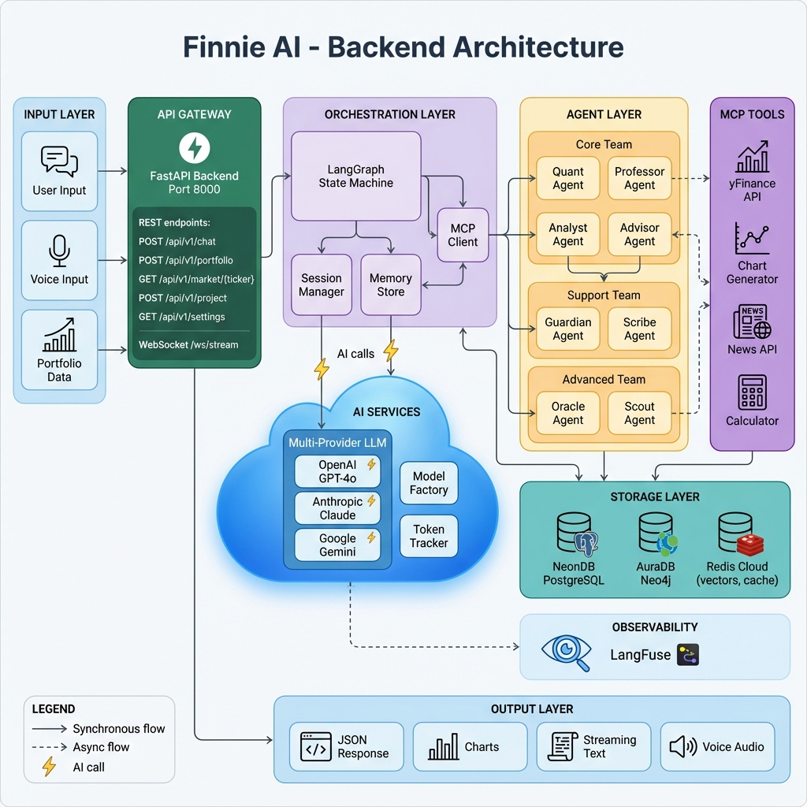
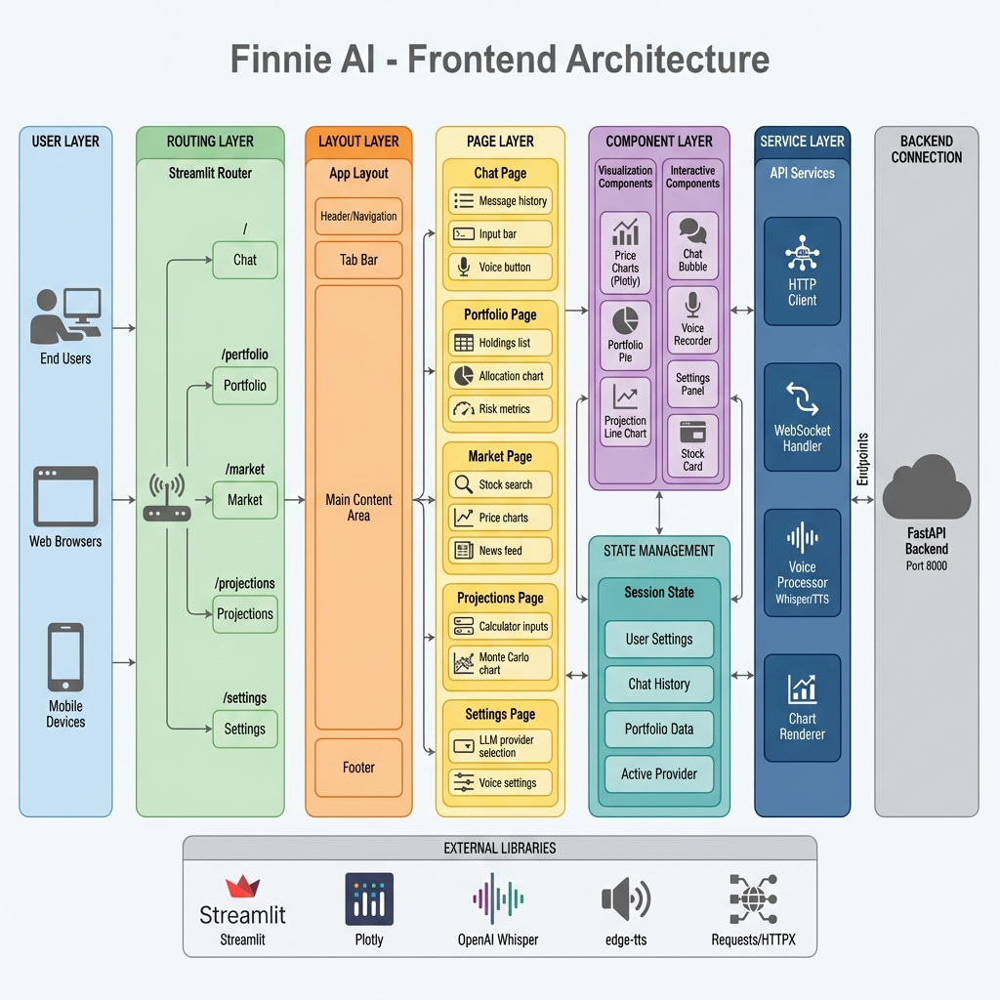
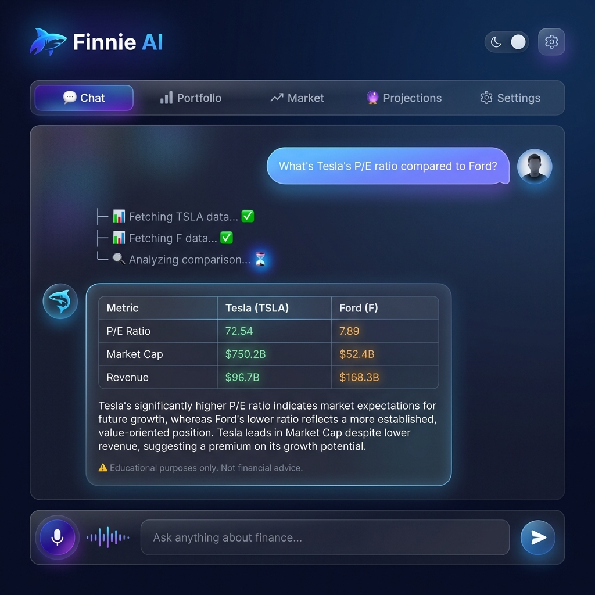
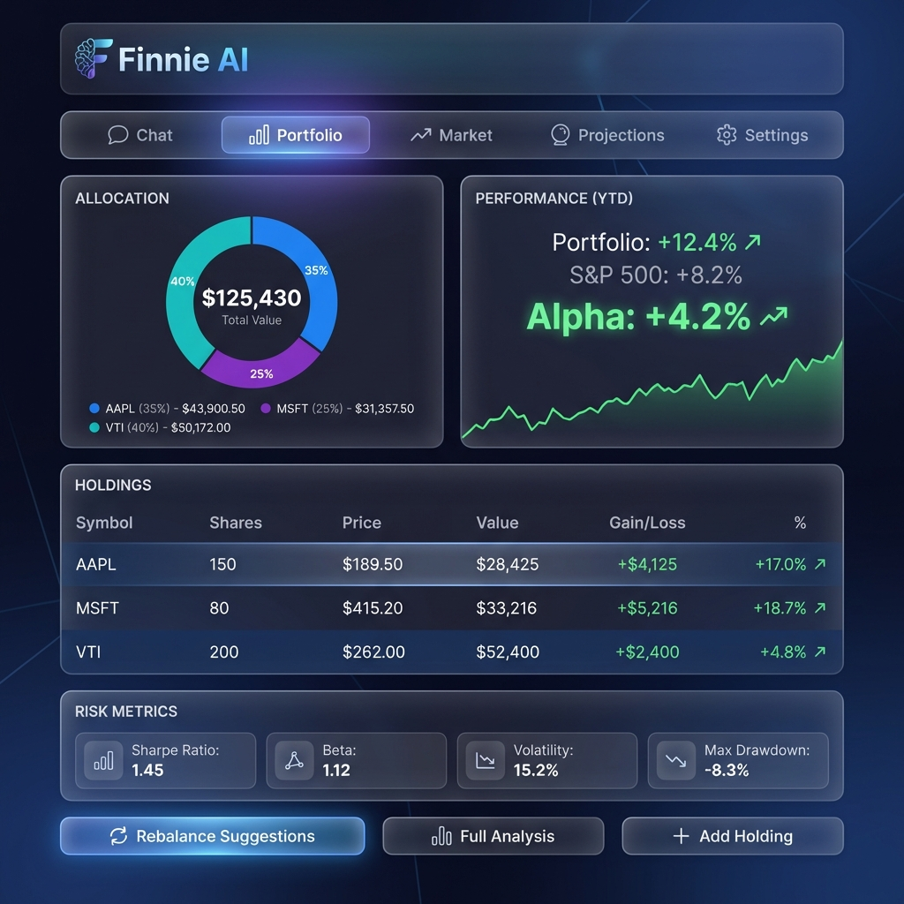
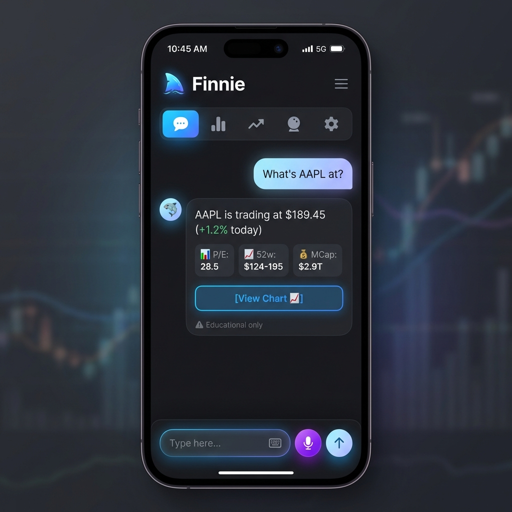
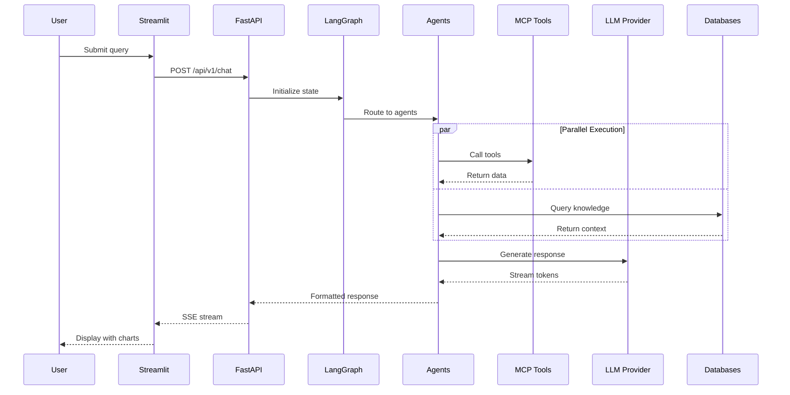

# Finnie AI — Architecture Documentation

> **Version:** 2.0.0  
> **Last Updated:** February 5, 2026

---

## Backend Architecture

The Finnie AI backend follows a layered architecture pattern with clear separation of concerns.

### Layers

| Layer | Components | Purpose |
|-------|------------|---------|
| **Input Layer** | User Input, Voice Input, Portfolio Data | Entry points for user interactions |
| **API Gateway** | FastAPI (Port 8000) | REST endpoints, WebSocket streaming |
| **Orchestration** | LangGraph, Session Manager, MCP Client | State machine, memory, tool coordination |
| **AI Services** | OpenAI, Anthropic, Google | Multi-provider LLM support |
| **Agent Layer** | 8 specialized agents | Domain-specific processing |
| **MCP Tools** | yFinance, Charts, News, Calculator | External integrations |
| **Storage** | NeonDB, AuraDB, Redis Cloud | Persistence layer |
| **Observability** | LangFuse | Tracing and monitoring |

---

## Frontend Architecture

The Finnie AI frontend is built with Streamlit for rapid development and responsive design.

### Layers

| Layer | Components | Purpose |
|-------|------------|---------|
| **User Layer** | Desktop, Mobile browsers | Cross-platform access |
| **Routing** | Streamlit Router | Tab-based navigation |
| **Layout** | Header, Tab Bar, Main Content | Consistent structure |
| **Pages** | Chat, Portfolio, Market, Projections, Settings | Feature screens |
| **Components** | Charts, Chat Bubbles, Stock Cards | Reusable UI elements |
| **State** | Session State | User settings, chat history |
| **Services** | HTTP Client, WebSocket, Voice | Backend communication |

---

## UI/UX Mockups

### Chat Interface

The primary interaction point with streaming responses and agent activity indicators.

**Key Features:**
- Dark mode with glassmorphism
- Agent activity indicators during processing
- Formatted tables and data
- Voice input button
- Compliance disclaimers

---

### Portfolio Tab

Portfolio management with allocation charts and risk metrics.

**Key Features:**
- Donut chart allocation
- YTD performance vs benchmark
- Holdings table with gains/losses
- Risk metrics dashboard
- Rebalancing suggestions

---

### Projections Calculator

Monte Carlo simulation for investment growth projections.

**Key Features:**
- Interactive input controls
- Time horizon selection
- Risk level slider
- Gradient-filled projection chart
- Conservative/Expected/Optimistic outcomes

---

### Mobile Responsive Design

Touch-optimized interface for smartphone users.

**Key Features:**
- Compact navigation
- Thumb-reachable controls
- Streamlined data display
- Voice button accessibility
- PWA-ready design

---

## Data Flow

---

## Technology Stack Summary

| Category | Technology |
|----------|------------|
| Frontend | Streamlit, Plotly, Custom CSS |
| Backend | FastAPI, LangGraph, MCP |
| LLMs | OpenAI GPT-4o, Claude, Gemini |
| Databases | NeonDB (Postgres), AuraDB (Neo4j), Redis Cloud |
| Voice | OpenAI Whisper, edge-tts |
| Observability | LangFuse |
| Deployment | Google Cloud Run, Docker |

---

*See [SPEC_DEV.md](../SPEC_DEV.md) for complete technical specifications.*
