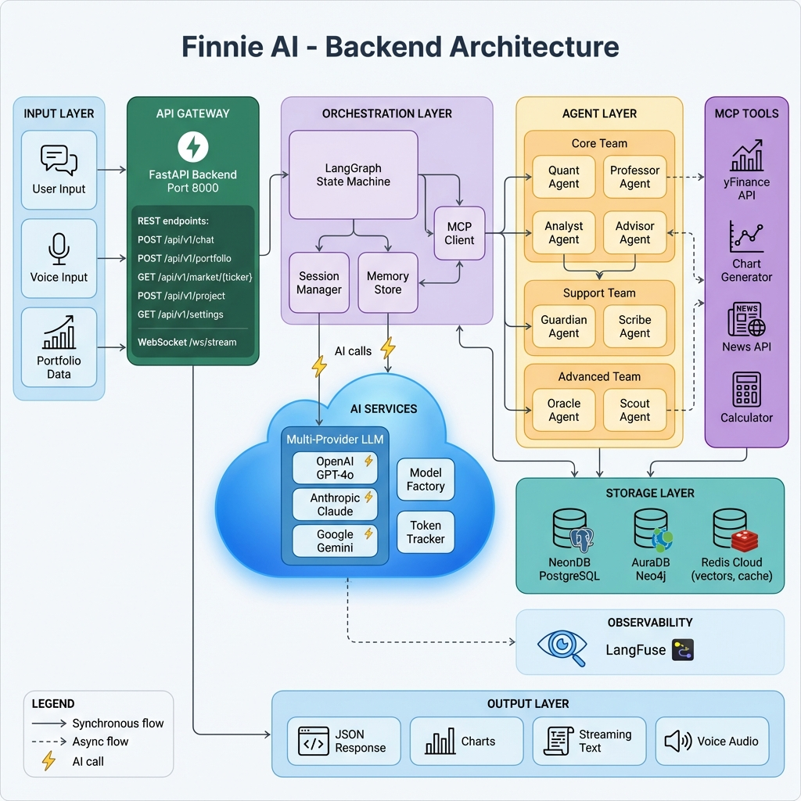
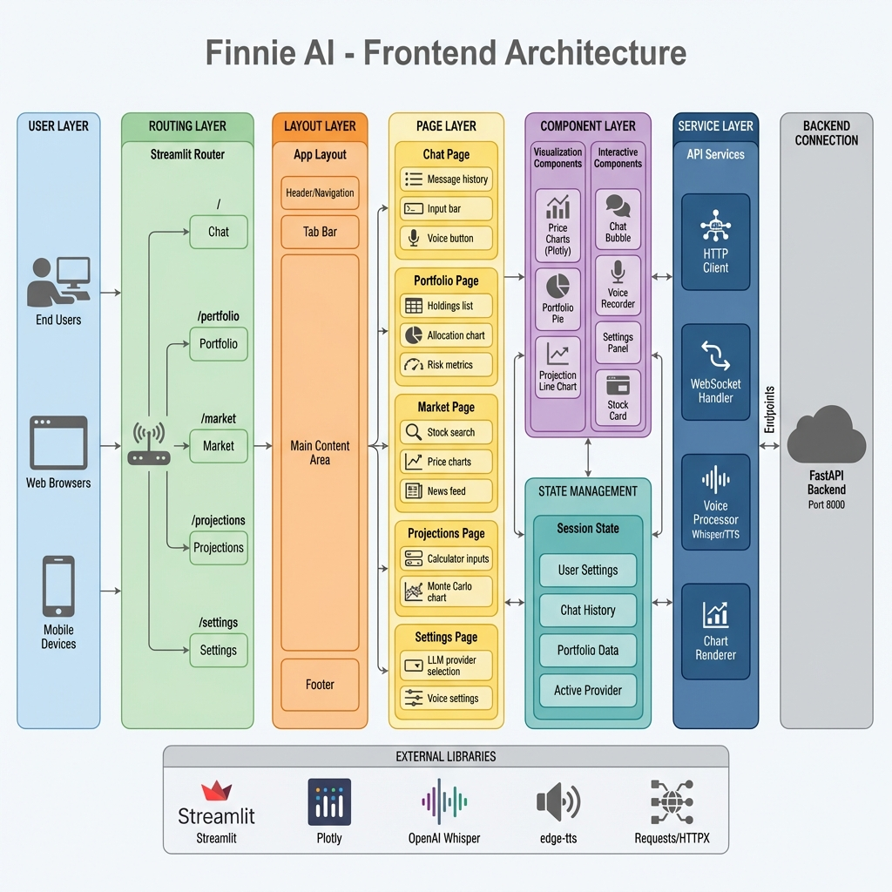
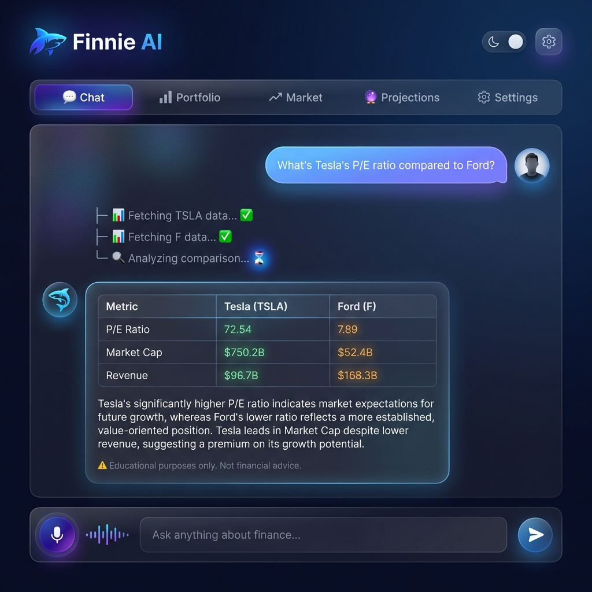
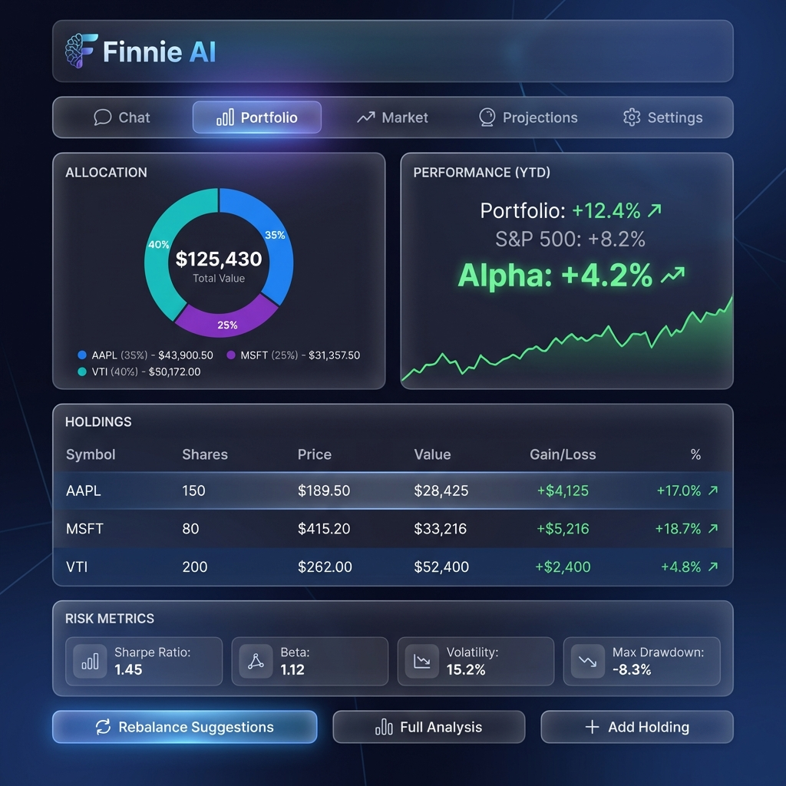
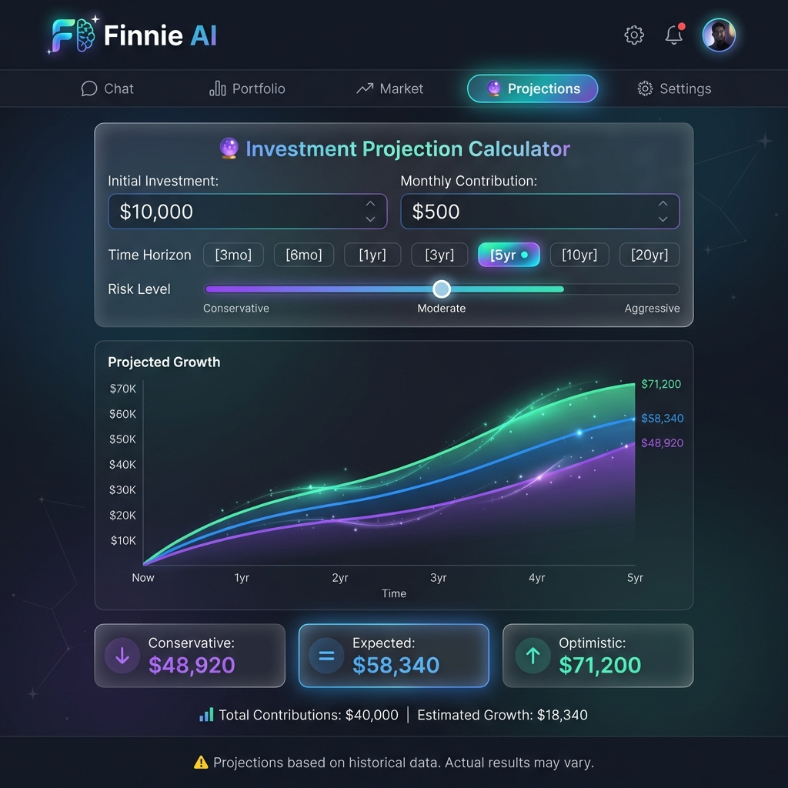
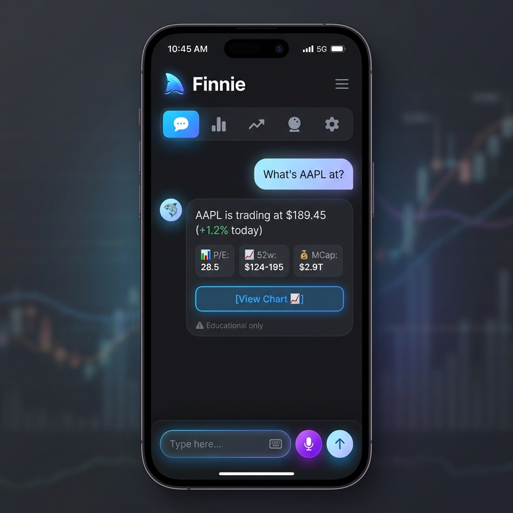
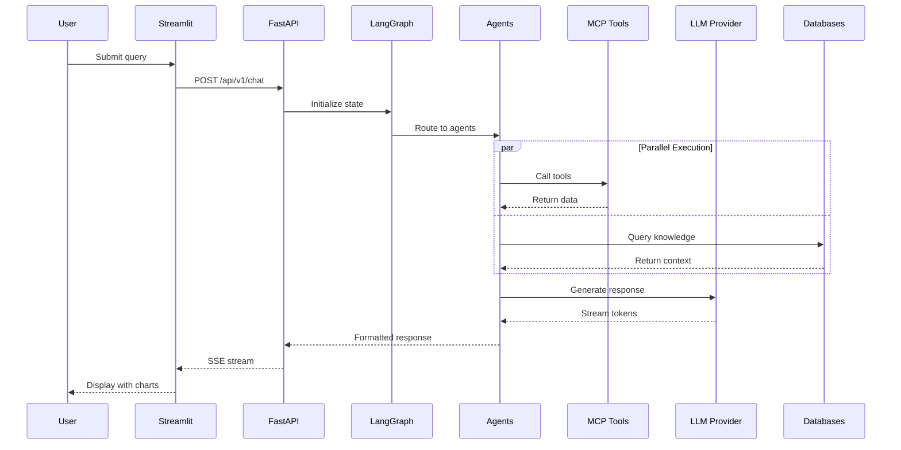

# Finnie AI — Architecture Documentation

> **Version:** 3.0.0  
> **Last Updated:** February 22, 2026

---

## Backend Architecture

The Finnie AI backend follows a layered architecture pattern with clear separation of concerns.

### Layers

| Layer | Components | Purpose |
|-------|------------|---------|
| **Input Layer** | User Input, Voice Input, Portfolio Data | Entry points for user interactions |
| **API Gateway** | FastAPI (Port 8000) | REST endpoints, WebSocket streaming |
| **LLM Gateway** | Smart Router, Budget Tracker | Routes queries to optimal model by complexity (free → cheap → full) |
| **Orchestration** | LangGraph, Enhancer Agent, Session Manager, MCP Client | State machine, prompt optimization, memory, tool coordination |
| **Context Manager** | Window Compression | Keeps original + recent, summarizes middle for long conversations |
| **AI Services** | OpenAI, Anthropic, Google | Multi-provider LLM support |
| **Agent Layer** | 11 specialized agents | Domain-specific processing (incl. Enhancer, Planner, Crypto) |
| **MCP Tools** | yFinance, Charts, CoinGecko, News, Calculator | External integrations |
| **Storage** | NeonDB, AuraDB, Redis Cloud | Persistence layer |
| **Observability** | Arize Phoenix + OpenTelemetry | Tracing and monitoring (localhost:6006) |

---

## Frontend Architecture

The Finnie AI frontend is built with Streamlit for rapid development and responsive design.

### Layers

| Layer | Components | Purpose |
|-------|------------|---------|
| **User Layer** | Desktop, Mobile browsers | Cross-platform access |
| **Routing** | Streamlit Router | Tab-based navigation |
| **Layout** | Header, Tab Bar, Main Content | Consistent structure |
| **Pages** | Chat, Portfolio, Market, Projections, Planner, Crypto, Settings | Feature screens (7 tabs) |
| **Components** | Charts, Chat Bubbles, Stock Cards | Reusable UI elements |
| **State** | Session State | User settings, chat history |
| **Services** | HTTP Client, WebSocket, Voice | Backend communication |

---

## UI/UX Mockups

### Chat Interface

The primary interaction point with streaming responses and agent activity indicators.

**Key Features:**
- Dark mode with glassmorphism
- Agent activity indicators during processing
- Formatted tables and data
- Voice input button
- Compliance disclaimers

---

### Portfolio Tab

Portfolio management with allocation charts and risk metrics.

**Key Features:**
- Donut chart allocation
- YTD performance vs benchmark
- Holdings table with gains/losses
- Risk metrics dashboard
- Rebalancing suggestions

---

### Projections Calculator

Monte Carlo simulation for investment growth projections.

**Key Features:**
- Interactive input controls
- Time horizon selection
- Risk level slider
- Gradient-filled projection chart
- Conservative/Expected/Optimistic outcomes

---

### Mobile Responsive Design

Touch-optimized interface for smartphone users.

**Key Features:**
- Compact navigation
- Thumb-reachable controls
- Streamlined data display
- Voice button accessibility
- PWA-ready design

---

## Data Flow

```mermaid
sequenceDiagram
    participant U as User
    participant UI as Streamlit
    participant API as FastAPI
    participant LG as LangGraph
    participant A as Agents
    participant T as MCP Tools
    participant LLM as LLM Provider
    participant DB as Databases

    U->>UI: Submit query
    UI->>API: POST /api/v1/chat
    API->>LG: Initialize state
    LG->>A: Route to agents
    
    par Parallel Execution
        A->>T: Call tools
        T-->>A: Return data
    and
        A->>DB: Query knowledge
        DB-->>A: Return context
    end
    
    A->>LLM: Generate response
    LLM-->>A: Stream tokens
    A-->>API: Formatted response
    API-->>UI: SSE stream
    UI-->>U: Display with charts
```

---

## Technology Stack Summary

| Category | Technology |
|----------|------------|
| Frontend | Streamlit, Plotly, Custom CSS |
| Backend | FastAPI, LangGraph, MCP |
| LLM Gateway | Smart Router (3-tier: free/cheap/full), Budget Tracker |
| LLMs | OpenAI GPT-4o, GPT-4o-mini, Claude, Gemini 2.0 Flash |
| Agents | 11 specialists (Enhancer, Quant, Professor, Scout, Oracle, Advisor, Analyst, Planner, Crypto, Guardian, Scribe) |
| Databases | NeonDB (Postgres), AuraDB (Neo4j), Redis Cloud |
| Voice | OpenAI Whisper, edge-tts |
| Observability | Arize Phoenix + OpenTelemetry |
| Evaluations | Arize Phoenix (Relevance, QA Quality, Hallucination, Toxicity) with Gemini Flash judge |
| Context Mgmt | Window compression: original + summary + recent |
| Deployment | Google Cloud Run, Docker |

---

*See [SPEC_DEV.md](../SPEC_DEV.md) for complete technical specifications.*
