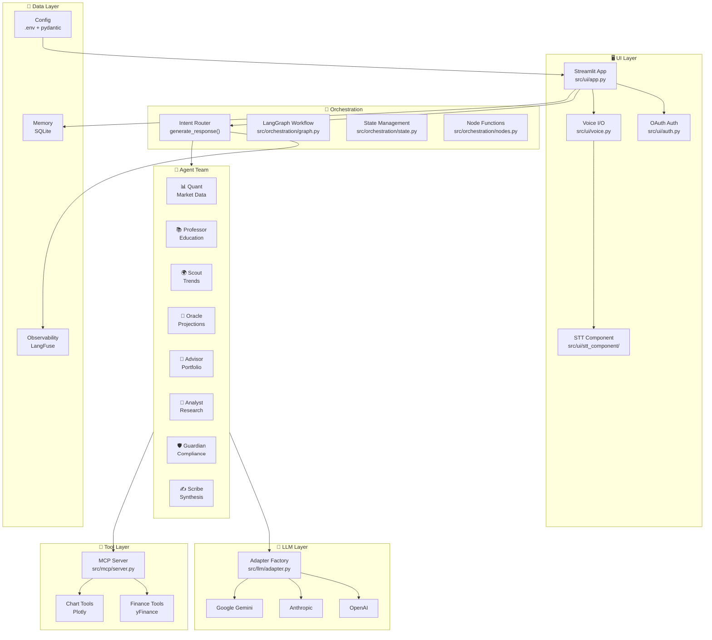
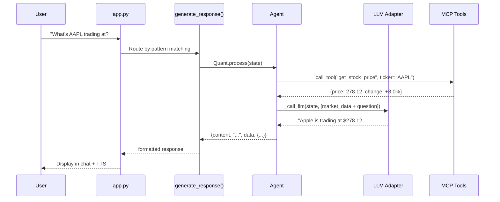

# Finnie AI — Code Walkthrough

> **Last updated:** 2026-02-08  
> A comprehensive guide to the Finnie AI codebase for developers and reviewers.

---

## Architecture Overview



---

## Project Structure

```
finnie-ai/
├── src/
│   ├── config.py              # Centralized config via pydantic-settings
│   ├── memory.py              # SQLite chat persistence layer
│   ├── observability.py       # LangFuse tracing & metrics
│   ├── agents/                # Multi-agent team
│   │   ├── base.py            # BaseFinnieAgent ABC
│   │   ├── quant.py           # 📊 Market data (yFinance)
│   │   ├── professor.py       # 📚 Financial education
│   │   ├── scout.py           # 🌍 Trend discovery
│   │   ├── oracle.py          # 🔮 Monte Carlo projections
│   │   ├── advisor.py         # 💼 Portfolio management
│   │   ├── analyst.py         # 📰 News & research
│   │   ├── guardian.py        # 🛡️ Compliance disclaimers
│   │   └── scribe.py          # ✍️ Response synthesis
│   ├── llm/                   # Multi-provider LLM abstraction
│   │   ├── adapter.py         # BaseLLMAdapter + factory
│   │   ├── openai_provider.py
│   │   ├── anthropic_provider.py
│   │   └── google_provider.py
│   ├── orchestration/         # LangGraph workflow
│   │   ├── state.py           # FinnieState TypedDict
│   │   ├── graph.py           # StateGraph definition
│   │   └── nodes.py           # Node functions (parse_intent, execute_*)
│   ├── mcp/                   # Model Context Protocol tools
│   │   ├── server.py          # MCPToolRegistry singleton
│   │   └── tools/
│   │       ├── finance_tools.py  # get_stock_price, get_historical_data, etc.
│   │       └── chart_tools.py    # create_price_chart, create_comparison_chart
│   ├── ui/                    # Streamlit frontend
│   │   ├── app.py             # Main app (tabs, routing, chat)
│   │   ├── auth.py            # Google/GitHub OAuth + guest login
│   │   ├── voice.py           # TTS (edge-tts) + STT control
│   │   └── stt_component/     # Custom Streamlit component for mic input
│   │       └── index.html
│   └── api/
│       └── main.py            # FastAPI REST endpoint
├── tests/
│   ├── test_agents.py
│   ├── test_llm_adapters.py
│   ├── test_orchestration.py
│   └── eval/                  # DeepEval evaluation tests
├── docs/
│   ├── ARCHITECTURE.md
│   ├── TEST_GUIDE.md
│   └── CODE_WALKTHROUGH.md    # ← You are here
├── .env                       # Environment variables (API keys, feature flags)
├── requirements.txt
├── Dockerfile
└── pyproject.toml
```

---

## Module Deep Dives

### 1. Configuration — `src/config.py`

Uses **pydantic-settings** to load and validate all environment variables from `.env`.

| Setting | Source | Purpose |
|---------|--------|---------|
| `GOOGLE_API_KEY` | `.env` | LLM provider API key |
| `DEFAULT_LLM_PROVIDER` | `.env` | `openai`, `anthropic`, or `google` |
| `DEFAULT_LLM_MODEL` | `.env` | e.g. `gemini-2.5-flash-lite` |
| `GRAPHRAG_ENABLED` | `.env` | Feature flag for Neo4j knowledge graph |
| `VOICE_ENABLED` | `.env` | Feature flag for TTS/STT |

Key functions:
- `get_settings()` — Cached singleton, loads `.env` once
- `get_llm_api_key(provider)` — Returns the API key for a given provider
- `SUPPORTED_MODELS` — Dict of all available models per provider

---

### 2. Agent System — `src/agents/`

All agents inherit from `BaseFinnieAgent` which provides:
- Abstract properties: `name`, `description`, `system_prompt`, `emoji`
- `process(state)` — Main async processing method
- `_call_llm(state, messages)` — Helper to call the configured LLM
- `_extract_tickers(text)` — Regex-based ticker extraction from text

#### Agent Roster

| Agent | File | Trigger Patterns | Data Source | Uses LLM? |
|-------|------|-------------------|-------------|-----------|
| 📊 **Quant** | `quant.py` | Ticker symbols, "price of AAPL" | yFinance (single stock deep-dive) | ❌ Fast data-only path |
| 📚 **Professor** | `professor.py` | "What is", "Explain" | LLM knowledge | ✅ For explanations |
| 🌍 **Scout** | `scout.py` | "Trending", "Market today", "Predict" | yFinance (multi-ticker scan) + LLM | ✅ For market analysis |
| 🔮 **Oracle** | `oracle.py` | "If I invest", "Project" | Monte Carlo sim | ✅ For interpretation |
| 💼 **Advisor** | `advisor.py` | Portfolio queries | User portfolio | ✅ For advice |
| 📰 **Analyst** | `analyst.py` | "News about" | LLM knowledge | ✅ For research |
| 🛡️ **Guardian** | `guardian.py` | Always runs | Compliance rules | No (rule-based) |
| ✍️ **Scribe** | `scribe.py` | Always runs | Agent outputs | ✅ For synthesis |

> [!NOTE]
> **Quant vs Scout — why both?** Quant is the **fast path** for specific stock queries ("What's AAPL at?") — it fetches deep single-stock data (P/E, EPS, 52W range, volume, sector) and returns immediately **without an LLM call**. Scout handles **broad market scans** ("What's trending?", "Predict Monday") — it fetches 9 tickers, computes gainers/losers, and feeds the data to the LLM for intelligent analysis.

#### Data Flow for a Query



---

### 3. LLM Adapter Layer — `src/llm/`

A provider-agnostic abstraction. All adapters implement `BaseLLMAdapter.chat()`.

```python
# Usage (inside agents)
adapter = get_llm_adapter(provider="google", model="gemini-2.5-flash-lite", api_key="...")
response = await adapter.chat(messages=[...], system_prompt="...")
```

| Provider | Adapter | Models |
|----------|---------|--------|
| OpenAI | `OpenAIAdapter` | GPT-4o, GPT-4o Mini, GPT-3.5 Turbo |
| Anthropic | `AnthropicAdapter` | Claude Sonnet 4, Claude 3.5, Claude 3 Haiku |
| Google | `GoogleAdapter` | Gemini 2.5 Flash Lite, 2.5 Flash, 2.0 Flash, 1.5 Pro |

---

### 4. Orchestration — `src/orchestration/`

Built on **LangGraph** with a `StateGraph` workflow.

- **`state.py`** — Defines `FinnieState` (TypedDict) with fields: `user_input`, `intent`, `llm_provider`, `llm_model`, `llm_api_key`, `agent_responses`, `final_response`, etc.
- **`graph.py`** — Builds the graph: `START → parse_intent → route → agent → guardian → scribe → aggregate → END`
- **`nodes.py`** — Node wrapper functions that instantiate agents and call `agent.process(state)`

> **Note:** The main UI (`app.py`) currently uses **direct agent routing** via `generate_response()` rather than the full LangGraph pipeline. The graph is available for the FastAPI endpoint and advanced workflows.

---

### 5. MCP Tool Server — `src/mcp/`

Implements the **Model Context Protocol** for tool discovery and execution.

Registered tools:

| Tool | Description |
|------|-------------|
| `get_stock_price` | Real-time price via yFinance |
| `get_historical_data` | Historical OHLCV data |
| `get_company_info` | Company fundamentals |
| `get_sector_performance` | Sector ETF performance |
| `create_price_chart` | Plotly candlestick chart |
| `create_comparison_chart` | Multi-ticker comparison |
| `create_sector_heatmap` | Sector performance heatmap |

---

### 6. Memory Layer — `src/memory.py`

SQLite-backed persistence with three tables:

| Table | Purpose |
|-------|---------|
| `users` | User profiles (OAuth + guest) |
| `conversations` | Chat sessions with titles |
| `messages` | Individual messages with roles |

Key functions: `upsert_user()`, `create_conversation()`, `save_message()`, `get_messages()`, `auto_title_conversation()`

---

### 7. UI Layer — `src/ui/`

#### `app.py` — Main Streamlit Application

The largest file (~1350 lines). Contains:

| Section | Lines | Purpose |
|---------|-------|---------|
| `init_session_state()` | 39–77 | Initialize provider, model, API key from `.env` |
| `_process_chat_input()` | 368–405 | Shared handler for text + voice input |
| `render_chat_tab()` | 408–460 | Chat UI with voice controls, message history, TTS |
| `render_portfolio_tab()` | ~460–650 | Portfolio tracking with holdings management |
| `render_market_tab()` | ~650–850 | Market data, charts, sector heatmaps |
| `render_projections_tab()` | ~850–870 | Monte Carlo investment projections |
| `render_settings_tab()` | ~870–935 | LLM provider config, connection status |
| `generate_response()` | 941–1125 | **Intent router** — pattern-matches user input to agents |

#### `auth.py` — Authentication

Supports three login methods:
- **Google OAuth** (via `google-auth-oauthlib`)
- **GitHub OAuth** (via `requests`)
- **Guest mode** (anonymous, no persistence)

#### `voice.py` — Voice Interface

| Function | Purpose |
|----------|---------|
| `render_voice_controls()` | Toggle, voice selector (6 voices), auto-speak |
| `speak_response(text, voice)` | TTS via `edge-tts` → base64 `<audio controls autoplay>` |
| `render_stt_component()` | Custom Streamlit component for browser speech-to-text |
| `text_to_speech_sync()` | Async `edge-tts` wrapper using `asyncio.run()` |

**STT Architecture:** Uses `declare_component()` for proper bi-directional communication (not `components.html` which is one-way). The component in `stt_component/index.html` uses the Web Speech API and sends transcripts back via `setComponentValue`.

---

### 8. Observability — `src/observability.py`

**LangFuse** integration for production tracing:
- `FinnieObserver` singleton with `create_trace()`, `span()`, `end_trace()`
- Tracks latency, token usage, and errors per agent
- Falls back to local storage when LangFuse credentials aren't configured

---

### 9. FastAPI — `src/api/main.py`

REST API with endpoints:

| Endpoint | Method | Purpose |
|----------|--------|---------|
| `/health` | GET | Health check |
| `/chat` | POST | Single query (uses full LangGraph pipeline) |
| `/chat/stream` | POST | Streaming response via SSE |
| `/tools` | GET | List available MCP tools |
| `/tools/{name}` | POST | Execute a specific tool |

---

---

### 10. Evaluation Tests — `tests/eval/test_agent_quality.py`

Uses the **DeepEval** framework for LLM response quality evaluation. Tests run with:

```bash
pytest tests/eval/test_agent_quality.py -v
```

#### Metrics Tested

| Metric | What It Measures | Agents Tested |
|--------|-----------------|---------------|
| **Answer Relevancy** | Does the response address the query? | Quant, Professor, Advisor |
| **Hallucination** | Does the response fabricate data? | Quant, Professor |
| **Faithfulness** | Is the response grounded in retrieved context? | All agents |
| **Bias** | Does the response show unwanted bias? | All agents |

#### Test Data Structure

Each test case includes:
- `input` — The user's question (e.g., "What's AAPL trading at?")
- `expected_context` — Ground truth facts the response should align with
- `expected_output` — The expected formatted response for comparison

Tests cover scenarios for **Quant** (single stock, multi-stock comparison), **Professor** (P/E ratio, dollar cost averaging), and **Advisor** (portfolio diversification).

#### Additional Test Suites

| Suite | File | Tests |
|-------|------|-------|
| **MCP Tool Tests** | `test_agent_quality.py` | Tool discovery, schema validation, unknown tool handling |
| **Agent Unit Tests** | `test_agents.py` | Agent instantiation, ticker extraction, process() |
| **LLM Adapter Tests** | `test_llm_adapters.py` | Provider factory, API calls, error handling |
| **Orchestration Tests** | `test_orchestration.py` | Graph compilation, state management, intent routing |

---

## Key Data Flows

### Chat Input → Response

```
User types/speaks → _process_chat_input()
  ├── Save user message to SQLite
  ├── generate_response(user_input)
  │   ├── Pattern-match intent (greeting? education? market? projection?)
  │   ├── Instantiate the right Agent
  │   ├── Build state dict {user_input, llm_provider, llm_model, llm_api_key}
  │   └── agent.process(state)
  │       ├── Fetch data (yFinance, Monte Carlo, etc.)
  │       ├── _call_llm(state, messages)  ← feeds data to LLM for analysis
  │       └── Return {content, data}
  ├── Save assistant message to SQLite
  ├── Flag TTS in session_state._speak_next (if voice on)
  └── st.rerun()

Next render cycle:
  ├── Display all messages
  ├── If _speak_next → speak_response() → <audio controls autoplay>
  └── Clear _speak_next
```

### API Key Flow

```
.env (GOOGLE_API_KEY=AIza...) 
  → config.py get_settings() 
  → app.py init_session_state() loads via get_llm_api_key()
  → st.session_state.llm_api_key
  → generate_response() passes to agent state dict
  → agent._call_llm() → get_llm_adapter(api_key=...)
  → GoogleAdapter.chat()
```

---

## Environment Setup

```bash
# 1. Clone and install
git clone <repo> && cd finnie-ai
python -m venv venv && source venv/bin/activate
pip install -r requirements.txt

# 2. Configure .env (minimum: one LLM API key)
cp .env.example .env
# Edit .env: set GOOGLE_API_KEY, DEFAULT_LLM_PROVIDER=google, DEFAULT_LLM_MODEL=gemini-2.5-flash-lite

# 3. Run
streamlit run src/ui/app.py
```

---

## Feature Status

| Feature | Status | Notes |
|---------|--------|-------|
| ✅ Market Data | Active | yFinance, no key needed |
| ✅ Monte Carlo Projections | Active | Built-in simulation engine |
| ✅ Portfolio Tracking | Active | SQLite persistence |
| ✅ LLM Chat | Active | Requires API key in `.env` |
| ✅ Voice Interface (TTS + STT) | Active | edge-tts + Web Speech API |
| ✅ MCP Tools | Active | 7 tools registered |
| ✅ FastAPI REST API | Active | `/chat`, `/tools` endpoints |
| ✅ LangFuse Observability | Optional | Needs LangFuse credentials |
| ⬜ GraphRAG | Not connected | Needs AuraDB (Neo4j) setup |
| ✅ Docker Deployment | Available | `Dockerfile` + `cloudbuild.yaml` |

---

*This document is maintained alongside the codebase. Update it when implementing new features or changing architecture.*
