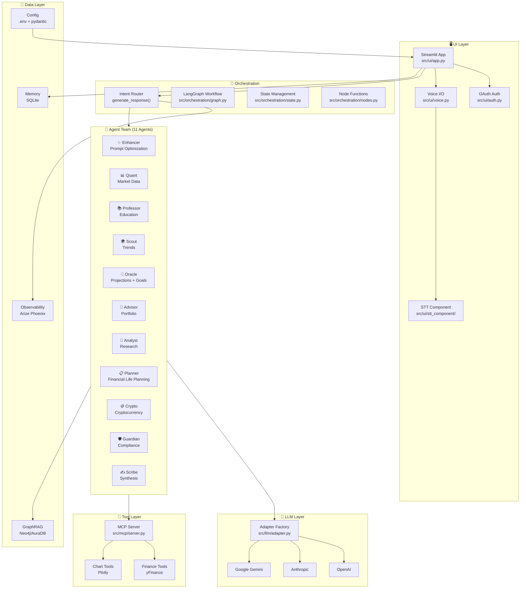
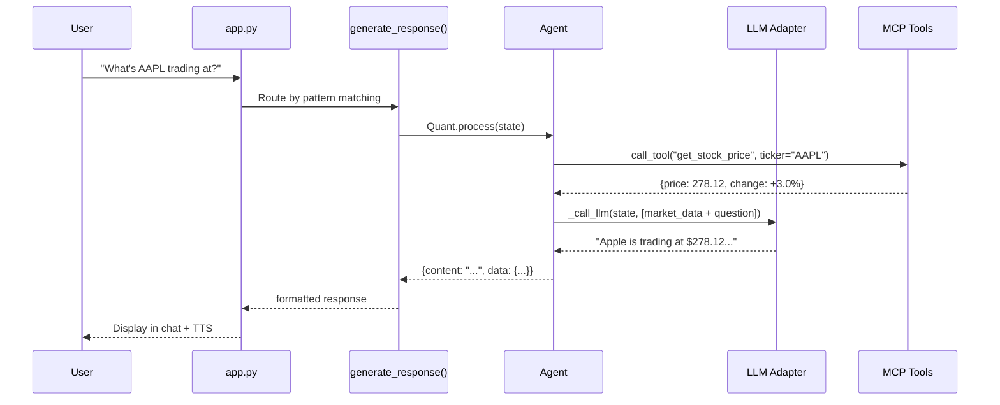
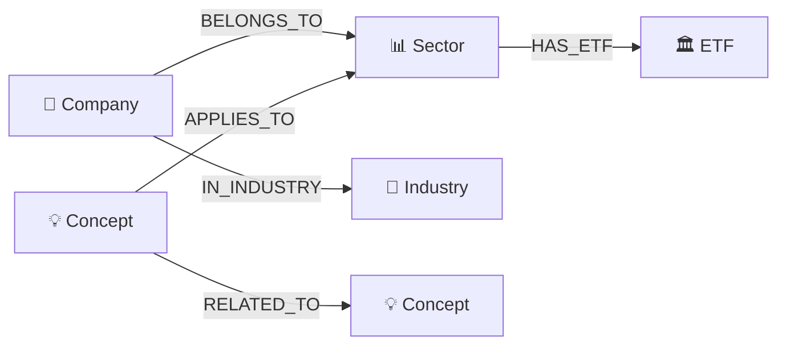

# Finnie AI — Code Walkthrough

> **Last updated:** 2026-02-22  
> A comprehensive guide to the Finnie AI codebase for developers and reviewers.

---

## Architecture Overview


```mermaid
graph TD
    subgraph UI["🖥️ UI Layer"]
        ST["Streamlit App<br/>src/ui/app.py"]
        AUTH["OAuth Auth<br/>src/ui/auth.py"]
        VOICE["Voice I/O<br/>src/ui/voice.py"]
        STT["STT Component<br/>src/ui/stt_component/"]
    end

    subgraph ORCH["🔀 Orchestration"]
        ROUTER["Intent Router<br/>generate_response()"]
        GRAPH["LangGraph Workflow<br/>src/orchestration/graph.py"]
        STATE["State Management<br/>src/orchestration/state.py"]
        NODES["Node Functions<br/>src/orchestration/nodes.py"]
    end

    subgraph AGENTS["🤖 Agent Team (11 Agents)"]
        ENHANCE["✨ Enhancer<br/>Prompt Optimization"]
        QUANT["📊 Quant<br/>Market Data"]
        PROF["📚 Professor<br/>Education"]
        SCOUT["🌍 Scout<br/>Trends"]
        ORACLE["🔮 Oracle<br/>Projections + Goals"]
        ADVISOR["💼 Advisor<br/>Portfolio"]
        ANALYST["📰 Analyst<br/>Research"]
        PLANNER["📋 Planner<br/>Financial Life Planning"]
        CRYPTO["🪙 Crypto<br/>Cryptocurrency"]
        GUARD["🛡️ Guardian<br/>Compliance"]
        SCRIBE["✍️ Scribe<br/>Synthesis"]
    end

    subgraph LLM["🧠 LLM Layer"]
        ADAPTER["Adapter Factory<br/>src/llm/adapter.py"]
        OAI["OpenAI"]
        ANT["Anthropic"]
        GOOG["Google Gemini"]
    end

    subgraph TOOLS["🔧 Tool Layer"]
        MCP["MCP Server<br/>src/mcp/server.py"]
        FIN["Finance Tools<br/>yFinance"]
        CHART["Chart Tools<br/>Plotly"]
    end

    subgraph DATA["💾 Data Layer"]
        MEM["Memory<br/>SQLite"]
        GR["GraphRAG<br/>Neo4j/AuraDB"]
        OBS["Observability<br/>Arize Phoenix"]
        CFG["Config<br/>.env + pydantic"]
    end

    ST --> AUTH
    ST --> VOICE
    VOICE --> STT
    ST --> ROUTER
    ROUTER --> AGENTS
    AGENTS --> ADAPTER
    ADAPTER --> OAI & ANT & GOOG
    AGENTS --> MCP
    MCP --> FIN & CHART
    AGENTS --> GR
    ST --> MEM
    ROUTER --> OBS
    CFG --> ST
```

---

## Project Structure

```
finnie-ai/
├── src/
│   ├── config.py              # Centralized config via pydantic-settings
│   ├── memory.py              # SQLite chat persistence layer
│   ├── observability.py       # Arize Phoenix + OpenTelemetry tracing
│   ├── agents/                # Multi-agent team (11 agents)
│   │   ├── base.py            # BaseFinnieAgent ABC
│   │   ├── enhancer.py        # ✨ Prompt optimizer (runs first)
│   │   ├── quant.py           # 📊 Market data (yFinance)
│   │   ├── professor.py       # 📚 Financial education
│   │   ├── scout.py           # 🌍 Trend discovery
│   │   ├── oracle.py          # 🔮 Monte Carlo + goal-based projections
│   │   ├── advisor.py         # 💼 Portfolio management
│   │   ├── analyst.py         # 📰 News & research
│   │   ├── planner.py         # 📋 Financial life planning (529, Roth, visa)
│   │   ├── crypto.py          # 🪙 Cryptocurrency (CoinGecko API)
│   │   ├── guardian.py        # 🛡️ Compliance disclaimers
│   │   └── scribe.py          # ✍️ Response synthesis
│   ├── llm/                   # Multi-provider LLM abstraction
│   │   ├── adapter.py         # BaseLLMAdapter + factory
│   │   ├── openai_provider.py
│   │   ├── anthropic_provider.py
│   │   └── google_provider.py
│   ├── orchestration/         # LangGraph workflow
│   │   ├── state.py           # FinnieState TypedDict (enhanced_input, new intents)
│   │   ├── graph.py           # StateGraph: enhancer → parse_intent → agents
│   │   └── nodes.py           # Node functions (execute_enhancer, execute_planner, etc.)
│   ├── mcp/                   # Model Context Protocol tools
│   │   ├── server.py          # MCPToolRegistry singleton
│   │   └── tools/
│   │       ├── finance_tools.py  # get_stock_price, get_historical_data, etc.
│   │       └── chart_tools.py    # create_price_chart, create_comparison_chart
│   ├── graphrag/              # Knowledge graph (Neo4j/AuraDB)
│   │   ├── graph_client.py    # Neo4j driver wrapper (singleton)
│   │   ├── ingest.py          # CLI ingestion pipeline
│   │   └── retriever.py       # Query functions for agents
│   ├── ui/                    # Streamlit frontend
│   │   ├── app.py             # Main app (8 tabs, routing, chat)
│   │   ├── auth.py            # Google OAuth + guest login
│   │   ├── voice.py           # TTS (edge-tts) + STT control
│   │   ├── stt_component/     # Custom Streamlit component for mic input
│   │   │   └── index.html
│   │   └── tabs/              # Modular UI tabs (v2.0)
│   │       ├── __init__.py
│   │       ├── chat.py        # 💬 Chat tab
│   │       ├── portfolio.py   # 💼 Portfolio tab
│   │       ├── market.py      # 📈 Market tab
│   │       ├── projections.py # 🔮 Projections tab
│   │       ├── planner.py     # 📋 Financial Planner tab
│   │       ├── crypto.py      # 🪙 Crypto Dashboard tab
│   │       ├── settings.py    # ⚙️ Settings tab
│   │       └── help.py        # ❓ Help + Knowledge Explorer tab
│   └── api/
│       └── main.py            # FastAPI REST endpoint
├── tests/
│   ├── test_agents.py
│   ├── test_llm_adapters.py
│   ├── test_orchestration.py
│   └── eval/                  # Arize Phoenix evaluation tests
│       └── test_phoenix_eval.py
├── docs/
│   ├── ARCHITECTURE.md
│   ├── TEST_GUIDE.md
│   └── CODE_WALKTHROUGH.md    # ← You are here
├── .env                       # Environment variables (API keys, feature flags)
├── requirements.txt
├── Dockerfile
└── pyproject.toml
```

---

## Module Deep Dives

### 1. Configuration — `src/config.py`

Uses **pydantic-settings** to load and validate all environment variables from `.env`.

| Setting | Source | Purpose |
|---------|--------|---------|
| `GOOGLE_API_KEY` | `.env` | LLM provider API key |
| `DEFAULT_LLM_PROVIDER` | `.env` | `openai`, `anthropic`, or `google` |
| `DEFAULT_LLM_MODEL` | `.env` | e.g. `gemini-2.5-flash-lite` |
| `GRAPHRAG_ENABLED` | `.env` | Feature flag for Neo4j knowledge graph |
| `VOICE_ENABLED` | `.env` | Feature flag for TTS/STT |

Key functions:
- `get_settings()` — Cached singleton, loads `.env` once
- `get_llm_api_key(provider)` — Returns the API key for a given provider
- `SUPPORTED_MODELS` — Dict of all available models per provider

---

### 2. Agent System — `src/agents/`

All agents inherit from `BaseFinnieAgent` which provides:
- Abstract properties: `name`, `description`, `system_prompt`, `emoji`
- `process(state)` — Main async processing method
- `_call_llm(state, messages)` — Helper to call the configured LLM
- `_extract_tickers(text)` — Regex-based ticker extraction from text

#### Agent Roster (11 Agents)

| Agent | File | Trigger Patterns | Data Source | Uses LLM? |
|-------|------|-------------------|-------------|-----------|
| ✨ **Enhancer** | `enhancer.py` | Always runs first | User input | ✅ Prompt optimization |
| 📊 **Quant** | `quant.py` | Ticker symbols, "price of AAPL" | yFinance (single stock deep-dive) | ❌ Fast data-only path |
| 📚 **Professor** | `professor.py` | "What is", "Explain" | GraphRAG + LLM | ✅ Graph-enriched explanations |
| 🌍 **Scout** | `scout.py` | "Trending", "Market today", "Predict" | yFinance (multi-ticker scan) + LLM | ✅ For market analysis |
| 🔮 **Oracle** | `oracle.py` | "If I invest", "Project", "I need $X by age Y" | Monte Carlo + goal sim | ✅ For interpretation |
| 💼 **Advisor** | `advisor.py` | Portfolio queries | User portfolio | ✅ For advice |
| 📰 **Analyst** | `analyst.py` | "News about" | LLM knowledge | ✅ For research |
| 📋 **Planner** | `planner.py` | "529", "Roth IRA", "retirement", "visa", "budget" | Financial planning knowledge | ✅ Life planning |
| 🪙 **Crypto** | `crypto.py` | "Bitcoin", "Ethereum", "crypto", "BTC" | CoinGecko API | ✅ Crypto analysis |
| 🛡️ **Guardian** | `guardian.py` | Always runs | Compliance rules | No (rule-based) |
| ✍️ **Scribe** | `scribe.py` | Always runs | Agent outputs | ✅ For synthesis |

> [!NOTE]
> **New in v2.0:** The **Enhancer** runs first to optimize user prompts before routing. **Planner** handles comprehensive financial life planning (retirement, 529, taxes, visa considerations). **Crypto** provides real-time cryptocurrency data via CoinGecko. **Oracle** now supports goal-based reverse projections.

#### Data Flow for a Query


```mermaid
sequenceDiagram
    participant U as User
    participant App as app.py
    participant R as generate_response()
    participant A as Agent
    participant L as LLM Adapter
    participant T as MCP Tools

    U->>App: "What's AAPL trading at?"
    App->>R: Route by pattern matching
    R->>A: Quant.process(state)
    A->>T: call_tool("get_stock_price", ticker="AAPL")
    T-->>A: {price: 278.12, change: +3.0%}
    A->>L: _call_llm(state, [market_data + question])
    L-->>A: "Apple is trading at $278.12..."
    A-->>R: {content: "...", data: {...}}
    R-->>App: formatted response
    App-->>U: Display in chat + TTS
```

---

### 3. LLM Adapter Layer — `src/llm/`

A provider-agnostic abstraction. All adapters implement `BaseLLMAdapter.chat()`.

```python
# Usage (inside agents)
adapter = get_llm_adapter(provider="google", model="gemini-2.5-flash-lite", api_key="...")
response = await adapter.chat(messages=[...], system_prompt="...")
```

| Provider | Adapter | Models |
|----------|---------|--------|
| OpenAI | `OpenAIAdapter` | GPT-4o, GPT-4o Mini, GPT-3.5 Turbo |
| Anthropic | `AnthropicAdapter` | Claude Sonnet 4, Claude 3.5, Claude 3 Haiku |
| Google | `GoogleAdapter` | Gemini 2.5 Flash Lite, 2.5 Flash, 2.0 Flash, 1.5 Pro |

---

### 4. Orchestration — `src/orchestration/`

Built on **LangGraph** with a `StateGraph` workflow.

- **`state.py`** — Defines `FinnieState` (TypedDict) with fields: `user_input`, `enhanced_input`, `intent`, `llm_provider`, `llm_model`, `llm_api_key`, `agent_responses`, `final_response`, etc. Includes `IntentType` (with `FINANCIAL_PLAN`, `GOAL_PLAN`, `CRYPTO`) and `AgentName` enums.
- **`graph.py`** — Builds the graph: `START → enhancer → parse_intent → route → agent → guardian → scribe → aggregate → END`
- **`nodes.py`** — Node wrapper functions: `execute_enhancer`, `execute_planner`, `execute_crypto`, plus expanded intent pattern matching for new domains.

> **Note:** The main UI (`app.py`) uses **direct agent routing** via `generate_response()` for the Chat tab, while the Planner and Crypto tabs use the modular tab architecture under `src/ui/tabs/`.

---

### 5. MCP Tool Server — `src/mcp/`

Implements the **Model Context Protocol** for tool discovery and execution.

Registered tools:

| Tool | Description |
|------|-------------|
| `get_stock_price` | Real-time price via yFinance |
| `get_historical_data` | Historical OHLCV data |
| `get_company_info` | Company fundamentals |
| `get_sector_performance` | Sector ETF performance |
| `create_price_chart` | Plotly candlestick chart |
| `create_comparison_chart` | Multi-ticker comparison |
| `create_sector_heatmap` | Sector performance heatmap |

---

### 6. Memory Layer — `src/memory.py`

SQLite-backed persistence with three tables:

| Table | Purpose |
|-------|---------|
| `users` | User profiles (OAuth + guest) |
| `conversations` | Chat sessions with titles |
| `messages` | Individual messages with roles |

Key functions: `upsert_user()`, `create_conversation()`, `save_message()`, `get_messages()`, `auto_title_conversation()`

---

### 7. UI Layer — `src/ui/`

#### `app.py` — Main Streamlit Application

The largest file (~1500 lines). Contains:

| Section | Purpose |
|---------|--------|
| `init_session_state()` | Initialize provider, model, API key from `.env` |
| `_process_chat_input()` | Shared handler for text + voice input |
| `render_chat_tab()` | Chat UI with voice controls, message history, TTS |
| `render_portfolio_tab()` | Portfolio tracking with holdings management |
| `render_market_tab()` | Market data, charts, sector heatmaps |
| `render_projections_tab()` | Monte Carlo investment projections |
| `render_settings_tab()` | LLM provider config, connection status |
| `generate_response()` | **Intent router** — pattern-matches user input to agents |

#### `auth.py` — Authentication

Supports two login methods:
- **Google OAuth** (via Streamlit's built-in OIDC)
- **Guest mode** (anonymous, no persistence)

> **Note:** GitHub OAuth is not supported because Streamlit requires OIDC and GitHub only provides plain OAuth 2.0.

#### `voice.py` — Voice Interface

| Function | Purpose |
|----------|---------|
| `render_voice_controls()` | Toggle, voice selector (6 voices), auto-speak |
| `speak_response(text, voice)` | TTS via `edge-tts` → base64 `<audio controls autoplay>` |
| `render_stt_component()` | Custom Streamlit component for browser speech-to-text |
| `text_to_speech_sync()` | Async `edge-tts` wrapper using `asyncio.run()` |

**STT Architecture:** Uses `declare_component()` for proper bi-directional communication (not `components.html` which is one-way). The component in `stt_component/index.html` uses the Web Speech API and sends transcripts back via `setComponentValue`.

---

### 8. Observability — `src/observability.py`

**Arize Phoenix** integration for production tracing:
- Auto-launches locally at `localhost:6006`
- OpenTelemetry-based tracing for all LLM calls and agent activity
- Tracks latency, token usage, and errors per agent
- No external account needed — runs fully local

---

### 9. FastAPI — `src/api/main.py`

REST API with endpoints:

| Endpoint | Method | Purpose |
|----------|--------|---------|
| `/health` | GET | Health check |
| `/chat` | POST | Single query (uses full LangGraph pipeline) |
| `/chat/stream` | POST | Streaming response via SSE |
| `/tools` | GET | List available MCP tools |
| `/tools/{name}` | POST | Execute a specific tool |

---

### 10. GraphRAG Knowledge Graph — `src/graphrag/`

Stores financial knowledge as a **connected graph** in Neo4j/AuraDB, enabling agents to retrieve relationship-aware context before calling the LLM.

#### Graph Schema


```mermaid
graph LR
    C["🏢 Company"] -->|BELONGS_TO| S["📊 Sector"]
    C -->|IN_INDUSTRY| I["📰 Industry"]
    S -->|HAS_ETF| E["🏛️ ETF"]
    CO["💡 Concept"] -->|RELATED_TO| CO2["💡 Concept"]
    CO -->|APPLIES_TO| S
```

| Node | Count | Properties | Source |
|------|-------|-----------|--------|
| `Company` | 55+ | ticker, name, marketCap, peRatio | yFinance (live) |
| `Sector` | 11 | name, description | GICS classification |
| `Concept` | 105 | name, definition, keyTakeaway, difficulty, category | Curated (concepts.json) |
| `ETF` | 18 | ticker, name, category | Curated |
| `Industry` | ~30 | name | yFinance |

#### Module Files

| File | Purpose |
|------|---------|
| `graph_client.py` | Neo4j driver wrapper — singleton, `run_query()`, `run_write()`, `verify_connection()` |
| `ingest.py` | CLI pipeline: `python -m src.graphrag.ingest` — populates all nodes and edges |
| `retriever.py` | Query functions agents call: `retrieve_concept_context()`, `retrieve_company_context()`, `retrieve_sector_context()` |

#### How It Enriches Agent Responses

```
User: "What is a P/E ratio?"
  ↓
Professor._get_graph_context("P/E ratio")
  → retrieve_concept_context("p/e ratio")
  → Cypher: MATCH (co:Concept)-[:RELATED_TO]->(r)
  → Returns: definition + related (EPS, Market Cap, Revenue)
  ↓
LLM prompt:
  "Knowledge graph context: [P/E Ratio definition, related: EPS, Market Cap...]
   User question: What is a P/E ratio?
   Use the knowledge graph context to enrich your explanation."
  ↓
LLM response is richer because it has structured context
```

#### Setup

```bash
# 1. Get a free AuraDB instance at https://neo4j.com/cloud/aura-free/
# 2. Update .env:
AURA_URI=neo4j+s://xxxxx.databases.neo4j.io
AURA_USER=neo4j
AURA_PASSWORD=your-password

# 3. Run ingestion
python -m src.graphrag.ingest

# 4. Verify (check Settings tab → GraphRAG should show ✅)
```

---

### 11. Evaluation Tests — `tests/eval/test_agent_quality.py`

Uses the **DeepEval** framework for LLM response quality evaluation. Tests run with:

```bash
pytest tests/eval/test_agent_quality.py -v
```

#### Metrics Tested

| Metric | What It Measures | Agents Tested |
|--------|-----------------|---------------|
| **Answer Relevancy** | Does the response address the query? | Quant, Professor, Advisor |
| **Hallucination** | Does the response fabricate data? | Quant, Professor |
| **Faithfulness** | Is the response grounded in retrieved context? | All agents |
| **Bias** | Does the response show unwanted bias? | All agents |

#### Test Data Structure

Each test case includes:
- `input` — The user's question (e.g., "What's AAPL trading at?")
- `expected_context` — Ground truth facts the response should align with
- `expected_output` — The expected formatted response for comparison

Tests cover scenarios for **Quant** (single stock, multi-stock comparison), **Professor** (P/E ratio, dollar cost averaging), and **Advisor** (portfolio diversification).

#### Additional Test Suites

| Suite | File | Tests |
|-------|------|-------|
| **MCP Tool Tests** | `test_agent_quality.py` | Tool discovery, schema validation, unknown tool handling |
| **Agent Unit Tests** | `test_agents.py` | Agent instantiation, ticker extraction, process() |
| **LLM Adapter Tests** | `test_llm_adapters.py` | Provider factory, API calls, error handling |
| **Orchestration Tests** | `test_orchestration.py` | Graph compilation, state management, intent routing |

---

## Key Data Flows

### Chat Input → Response

```
User types/speaks → _process_chat_input()
  ├── Save user message to SQLite
  ├── generate_response(user_input)
  │   ├── Pattern-match intent (greeting? education? market? projection?)
  │   ├── Instantiate the right Agent
  │   ├── Build state dict {user_input, llm_provider, llm_model, llm_api_key}
  │   └── agent.process(state)
  │       ├── Fetch data (yFinance, Monte Carlo, etc.)
  │       ├── _call_llm(state, messages)  ← feeds data to LLM for analysis
  │       └── Return {content, data}
  ├── Save assistant message to SQLite
  ├── Flag TTS in session_state._speak_next (if voice on)
  └── st.rerun()

Next render cycle:
  ├── Display all messages
  ├── If _speak_next → speak_response() → <audio controls autoplay>
  └── Clear _speak_next
```

### API Key Flow

```
.env (GOOGLE_API_KEY=AIza...) 
  → config.py get_settings() 
  → app.py init_session_state() loads via get_llm_api_key()
  → st.session_state.llm_api_key
  → generate_response() passes to agent state dict
  → agent._call_llm() → get_llm_adapter(api_key=...)
  → GoogleAdapter.chat()
```

---

## Environment Setup

```bash
# 1. Clone and install
git clone <repo> && cd finnie-ai
python -m venv venv && source venv/bin/activate
pip install -r requirements.txt

# 2. Configure .env (minimum: one LLM API key)
cp .env.example .env
# Edit .env: set GOOGLE_API_KEY, DEFAULT_LLM_PROVIDER=google, DEFAULT_LLM_MODEL=gemini-2.5-flash-lite

# 3. Run
streamlit run src/ui/app.py
```

---

## Feature Status

| Feature | Status | Notes |
|---------|--------|-------|
| ✅ Market Data | Active | yFinance, no key needed |
| ✅ Monte Carlo Projections | Active | Forward + goal-based simulations |
| ✅ Portfolio Tracking | Active | SQLite persistence |
| ✅ LLM Chat | Active | Requires API key in `.env` |
| ✅ Voice Interface (TTS + STT) | Active | edge-tts + Web Speech API |
| ✅ MCP Tools | Active | 7 tools registered |
| ✅ FastAPI REST API | Active | `/chat`, `/tools` endpoints |
| ✅ Arize Phoenix Observability | Active | Dashboard at `localhost:6006` |
| ✅ Financial Life Planner | Active | 529, Roth IRA, retirement, visa, budget, side hustles |
| ✅ Crypto Dashboard | Active | CoinGecko live prices, allocation guide, tax info |
| ✅ Prompt Enhancer | Active | First node in LangGraph — optimizes user queries |
| ✅ Phoenix Evaluations | Active | Replaces DeepEval — relevance, hallucination, faithfulness |
| ✅ GraphRAG | Ready | Run `python -m src.graphrag.ingest` after AuraDB setup |
| ✅ Docker Deployment | Available | `Dockerfile` + `cloudbuild.yaml` |

---

*This document is maintained alongside the codebase. Update it when implementing new features or changing architecture.*
